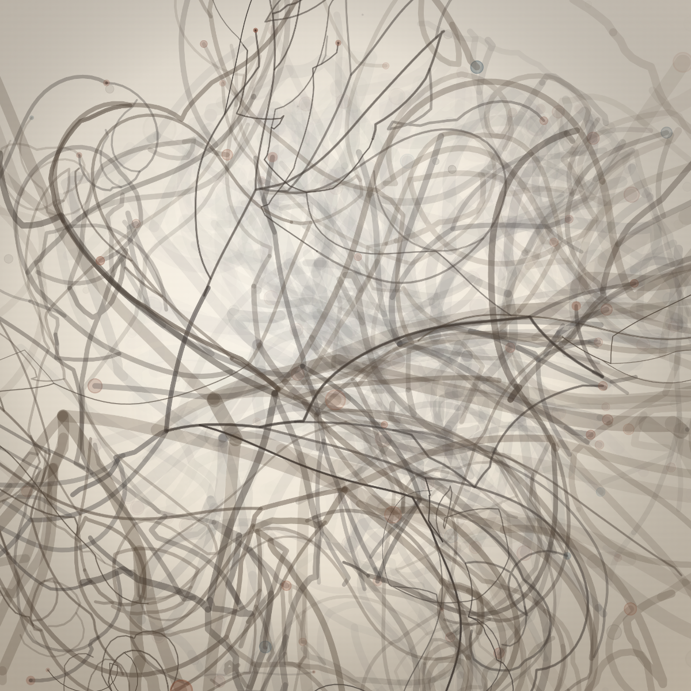

# Micélio

**Autor:** Victor Hugo Figueiredo Pereira da Silva

**Artefato da semana 05** — tema da aula 5: *Agentes*.



## Ideia do trabalho

Uma colônia de fungos crescendo dentro de um bloco de substrato, **filmada por
uma lente macro**. Os fios da colônia (as hifas) são agentes: cada ponta é um
bichinho que anda, entorta, se ramifica e morre quando esbarra no rastro de
alguém. O que a gente vê na tela é só o rastro que eles deixaram.

Mas o assunto do sketch não é o desenho — é a **óptica**. A pergunta que eu quis
responder foi: *dá para fazer uma imagem parecer funda sem usar ponto de fuga?*

Olhando os artefatos das semanas 1 a 4 da turma, quase toda impressão de
profundidade que apareceu veio do mesmo lugar: **linhas convergindo para um
ponto de fuga** — estradas, túneis, ruas entre prédios, espirais e mandalas
puxando para o centro. É um recurso de desenho. Aqui eu quis o outro caminho, o
de **fotografia**: a cena tem coordenadas 3D de verdade e uma câmera virtual
olhando para elas, e a profundidade sai dos cinco sinais que um fotógrafo usa
para dizer "isto está perto e aquilo está longe".

## Os cinco sinais de profundidade (a parte técnica do trabalho)

Nada na imagem é achatado de propósito: cada hifa tem `x`, `y` **e `z`**, e o
que chega à tela passa por uma câmera.

**1. Perspectiva.** A câmera fica a uma distância `distCamera` do centro do
bloco. Um ponto a uma distância `d` da lente é desenhado com escala
`s = f / d`: o que está no fundo encolhe, o que está na frente cresce. A
espessura do fio também é multiplicada por `s` — não adianta encolher a posição
e manter o traço grosso.

**2. Oclusão.** Todos os pedaços de filamento, esporângios e esporos soltos são
**ordenados pela distância** e desenhados do mais longe para o mais perto
(algoritmo do pintor). Quem está na frente tapa quem está atrás. Esse é o sinal
que mais convence o olho de que existe uma coisa na frente da outra.

**3. Perspectiva aérea.** O que está longe tende à cor do "ar" entre a lente e
o objeto (`corNevoa`): perde contraste e muda de temperatura. Nas paletas
escuras o fundo esfria e some no preto; na paleta clara, ao contrário, o que
está longe **clareia** até desaparecer no papel. A regra física é a mesma, só
muda a cor do ar.

**4. Desfoque — o recurso principal.** Só **um plano de distância** fica nítido;
o resto borra. O quanto borra vem da fórmula da lente fina, o *círculo de
confusão*:

```
c = A · f · | 1/dFoco − 1/d |
```

onde `A` é o diâmetro do diafragma, `f` a distância focal, `dFoco` a distância
do plano nítido e `d` a distância do objeto. Um ponto a uma distância `d ≠ dFoco`
não vira um ponto na imagem: vira um **disco** de diâmetro `c`. Repare no termo
`1/d` — é por isso que o que está na frente do foco borra muito mais depressa do
que o que está atrás dele, exatamente como numa foto de verdade.

Duas consequências que eu tive que programar à mão:

- **conservação de tinta.** Borrar espalha a *mesma* tinta numa área maior, então
  o traço desfocado tem de ficar proporcionalmente mais fraco: um fio ganha
  `alfa ∝ nítido / (nítido + c)`, e um ponto de luz, que é um disco e não uma
  linha, ganha `alfa ∝ (nítido / raio)²`. Sem isso o desfoque vira só "linha
  mais grossa", e não desfoque.
- **bokeh.** Um ponto de luz bem fora de foco não vira um borrão degradê, vira um
  **disco com a borda mais clara que o miolo** — é o formato do diafragma
  aparecendo. Os esporângios (as cabecinhas no fim das hifas) e os esporos
  soltos são desenhados assim.

**5. Paralaxe.** A câmera deriva de um lado para o outro, devagar. O que está
perto atravessa a tela mais rápido do que o que está longe. É o único sinal que
precisa de movimento — e é o que mata qualquer dúvida de que a cena é um volume.

### O mouse é o anel de foco

Mexer o mouse **de cima para baixo** puxa o plano de foco do fundo até a frente
da colônia, como girar o anel de foco de uma lente. Essa é a interação que prova
que a cena tem volume: é a mesma colônia, mas coisas diferentes ficam nítidas em
momentos diferentes. Com o mouse parado a lente "respira" sozinha, indo e
voltando. **Mexer o mouse na horizontal** empurra a paralaxe para o lado.

## A parte de agentes (o requisito da semana)

A estrutura toda é o rastro de agentes, na sequência que foi vista na aula 5:

| Na aula 5 | Neste sketch |
| --- | --- |
| agente ingênuo: anda e deposita rastro | `Ponta.avancar()` dá um passo e empurra um ponto no filamento |
| a direção vem do ruído | dois valores de `noise()` viram desvios nos dois eixos **perpendiculares à direção atual** (base ortonormal montada com produto vetorial), e não nos eixos do mundo |
| agente esperto: **lê o próprio rastro** antes de andar | uma grade de ocupação, agora em **3D** (`Uint8Array` de 52³ células): a ponta consulta a célula de destino antes de pisar nela |
| o que fazer quando não dá para andar | tenta até 5 direções alternativas, cada uma com desvio maior; se todas estiverem ocupadas, **morre ali** |
| agregação / empacotamento | a célula da grade é o **espaço mínimo entre dois fios**: é isso que abre os vãos escuros por onde se enxergam as camadas de trás |
| um agente vira dois | ramificação com probabilidade proporcional à espessura, até 9 gerações |
| tudo em `class` | `class Ponta`, com `this.x/y/z`, `this.dx/dy/dz`, `this.esp`, `this.geracao` |

Três detalhes que só apareceram depois de rodar e olhar:

- **o passo não é o tamanho da célula.** No começo eu tinha amarrado os dois, e
  isso quebrava dos dois lados: grade fina fazia os fios se encostarem e a
  colônia virava um feltro sólido; grade grossa fazia o passo ficar longo e as
  hifas morriam na borda antes de conseguir ramificar. Hoje a **célula** mede o
  espaço entre hifas diferentes (grossa) e o **passo** mede o quanto a curva é
  lisa (curto). O que impede a hifa de tropeçar no próprio rastro é uma listinha
  das últimas 6 células que **ela mesma** marcou.
- **a colônia cresce em camadas.** O componente `z` da direção é amassado, então
  cada hifa fica quase dentro da sua própria fatia de profundidade — como o
  micélio real, que se espalha sobre interfaces e não como uma bola homogênea.
  Isso serve à imagem duas vezes: dá a leitura de vários planos, um atrás do
  outro, e deixa o desfoque de cada filamento ser honestamente constante do
  começo ao fim dele.
- **cada inóculo tem alcance limitado.** Sem isso todas as fatias preenchiam o
  quadro inteiro e, somadas, viravam uma bola de algodão uniforme. Com alcance
  limitado cada fatia ocupa só um pedaço, e sobra vão escuro. **Sem vão não há
  profundidade** — não adianta ter camadas se não dá para ver entre elas.

## O que a semente sorteia

Como numa coleção de arte generativa, uma única semente decide a obra inteira:

- a **paleta**, entre três — `placa de Petri` (papel claro, hifa de tinta sépia,
  esporo terracota), `bioluminescência` (fundo azul-petróleo, hifa verde-água,
  esporo lilás e ciano) e `ferrugem` (fundo marrom, hifa cobre e palha, névoa
  verde-oliva);
- quantos inóculos, em que fatias de profundidade e com que alcance cada um
  cresce;
- o tom de cada mancha, a espessura das hifas primárias e onde nascem os
  esporângios;
- a nuvem de esporos soltos, inclusive os que ficam **mais perto da lente do que
  o próprio bloco** — são eles que viram os discos enormes e quase transparentes
  na frente de tudo, o cartão de visitas de uma foto macro.

Um detalhe chato que precisou de conserto: o gerador do p5 é um LCG simples e o
**primeiro** valor devolvido depois de `randomSeed()` fica correlacionado com a
semente. Como o primeiro sorteio do sketch era justamente a paleta, todas as
sementes que eu testei caíam na mesma cor. A função `embaralhar()` queima 12
rodadas antes de começar. (Foi exatamente o mesmo problema do artefato 04.)

## Tamanho e responsividade

O canvas ocupa a janela inteira e todas as medidas do mundo são proporcionais ao
menor lado dela. Redimensionar a janela **não** recomeça o crescimento: a colônia
vive em coordenadas do mundo, então mudar a janela só muda o enquadramento da
câmera. A câmera também se reenquadra sozinha no centro de massa da colônia
enquanto ela cresce — sem isso, metade das sementes nascia encostada na borda.

## Controles

| tecla / gesto | o que faz |
| --- | --- |
| mouse ↕ | plano de foco (o anel de foco da lente) |
| mouse ↔ | paralaxe lateral da câmera |
| clique ou `N` | nova colônia (nova semente, nova paleta) |
| `ESPAÇO` | termina de crescer na hora |
| `A` | abre / fecha o diafragma (mais ou menos desfoque) |
| `P` | pausa / retoma a deriva da câmera |
| `H` | mostra / esconde a legenda |
| `S` | salva a imagem em PNG |

## Como executar

1. Abra o arquivo `index.html` no navegador. Ele carrega **apenas** a biblioteca
   p5.js pelo CDN (sem p5.sound e sem cópia local) e o `sketch.js`. **Ou**
2. cole o conteúdo de `sketch.js` no [editor.p5js.org](https://editor.p5js.org)
   e rode (▶).

## Prompt utilizado (Claude Code, modelo Opus 5)

Desta vez eu não escrevi um pedido curto: escrevi o plano da imagem inteiro
antes de pedir o código, porque o enunciado avisa que repetir tema de semana
anterior custa ponto e eu queria fechar o assunto antes de começar.

> Antes de escrever qualquer linha, entre no
> <https://esperanc.github.io/CreativeCoding2026/sketches/> e leia **tudo** que
> já foi postado nas pastas "Artefato da Semana" 1 a 4 — título, descrição e
> imagem de cada um. Eu preciso de "inspiração negativa": quero fazer algo que
> não se pareça com nada que já está lá. Repare especialmente em como esse
> pessoal criou profundidade, porque é disso que eu quero tratar.
>
> Minha ideia é a seguinte. Quero uma **colônia de fungos crescendo dentro de um
> bloco de substrato, vista por uma lente macro**. Os fios da colônia são os
> agentes da aula 5: cada ponta de hifa anda, entorta seguindo ruído, se
> ramifica, lê o próprio rastro numa grade de ocupação e morre quando não tem
> mais para onde ir. O desenho é só o rastro deles.
>
> Mas o ponto do trabalho não é o fungo, é a **óptica**. Eu quero uma imagem que
> dê impressão de profundidade **sem ponto de fuga** — nada de estrada, túnel,
> rua entre prédios ou espiral puxando para o centro, que é o que todo mundo já
> fez. Quero que a profundidade venha de imitar uma câmera de verdade:
>
> 1. a cena tem coordenadas 3D e uma câmera projeta com escala `f / distância`,
>    inclusive a espessura do traço;
> 2. tudo é ordenado por distância e desenhado do fundo para a frente, para o que
>    está na frente tapar o que está atrás;
> 3. o que está longe perde contraste e tende à cor do ar;
> 4. **só um plano de distância fica nítido** — o resto borra pela fórmula do
>    círculo de confusão da lente fina, `c = A·f·|1/dFoco − 1/d|`. E borrar tem
>    que deixar o traço mais fraco na mesma proporção em que o alarga, senão não
>    parece desfoque, parece linha grossa. Os pontos de luz bem fora de foco têm
>    que virar discos de bokeh, com a borda mais clara que o miolo;
> 5. a câmera deriva devagar de lado, para dar paralaxe.
>
> E quero uma interação que prove que a cena é um volume: **o mouse na vertical é
> o anel de foco**. Arrastar de cima para baixo puxa o plano nítido do fundo até
> a frente da colônia, e coisas diferentes ficam nítidas em momentos diferentes.
> Com o mouse parado, a lente respira sozinha.
>
> Canvas do tamanho da janela, tudo proporcional ao menor lado, uma única semente
> decidindo a obra inteira, e código em português comentado de um jeito que
> qualquer pessoa da turma entenda. Escreva, rode, **olhe o resultado** e ajuste
> até a imagem realmente ter fundo — não me entregue o primeiro que compilar.

Depois disso o ajuste foi todo por renderização de teste, olhando e voltando ao
código. As correções que mais mudaram o resultado estão contadas ao longo deste
README: a junta entre pedaços de filamento que virava um colar de contas, o
passo amarrado ao tamanho da célula, a colônia que virava bola de algodão, o
enquadramento que nascia torto e a paleta que sempre saía igual. Num segundo
momento pedi ainda:

> Quero mudança de cor, e quero que a paleta seja sorteada entre as gerações dos
> sketches — cada colônia nova nasce com uma cor diferente.

## Arquivos deste pacote

- `sketch.js` — o sketch p5.js (comentado em português).
- `index.html` — página para rodar o sketch fora do editor.
- `thumbnail.png` — uma das imagens geradas pelo sketch (paleta *placa de Petri*).
- `README.md` — este arquivo.
