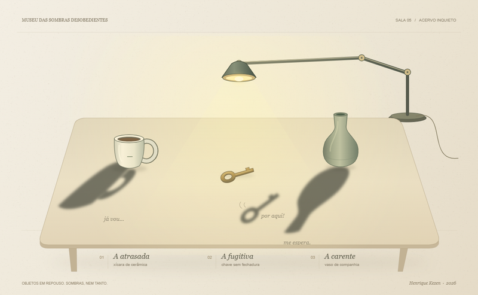

# Museu das Sombras Desobedientes

> Quando a luz se distrai, as sombras deixam de obedecer.

**Autor:** Henrique Kezen  
**Linguagem:** JavaScript, com p5.js  
**Categoria:** arte interativa — Artefato 5: E agora, algo completamente diferente  
**Desenvolvimento:** Henrique Kezen, com assistência de IA na elaboração do código e da documentação.

## Descrição

Uma pequena exposição de objetos cotidianos: uma xícara, uma chave e um vaso sobre uma mesa. A luminária acompanha o mouse, iluminando a superfície de papel com uma luz amarela. Os objetos permanecem imóveis, mas suas sombras possuem personalidades próprias.

A sombra da xícara demora a acompanhar a luz. A da chave tenta escapar. A do vaso procura a companhia da sombra vizinha. Depois de alguns segundos sem mover o mouse, elas se soltam: saltitam, dançam e se aproximam. Ao perceberem um novo movimento, retornam às suas posições como se nada tivesse acontecido.

O desenho usa uma paleta contida, textura de papel, contornos delicados e sombras com bordas suaves. A interação alterna observação e distração: para descobrir a cena, o visitante precisa parar de interferir nela.

## Inspiração negativa e relação com os artefatos anteriores

O ponto de partida foi a consulta à [galeria de Creative Coding 2026, nas coleções Artefato da Semana 1 a 4](https://esperanc.github.io/CreativeCoding2026/sketches/), conforme a proposta do Artefato 5.

Os títulos, descrições e miniaturas consultados mostraram temas como paisagens, espaço, futebol, personagens, mosaicos e campos de fluxo. O trabalho anterior do autor, **O Mar entre as Dobras**, também explorava uma paisagem e um movimento contínuo de ondas.

Neste sketch, a diferença está no tema e na dinâmica: uma natureza-morta cotidiana se transforma em uma pequena narrativa de comportamento. As sombras deixam de ser apenas consequências da iluminação e passam a agir como personagens. A pausa do visitante participa da obra, revelando uma ação que o próprio movimento interrompe. A galeria funciona como referência de contraste; não foram reutilizados códigos, imagens ou composições dos trabalhos consultados.

## Prompt de criação

Crie o artefato sobre o tema Museu das Sombras desobedientes, que terá um mesa com objetos normais, ao mover a luminária com o mouse, a magica acontece, as sobras se mostram loucas e possuem vontade propria uma demora para acompanhar, outra tenta fugir e outra se aproxima da sombra vizinha.
**Visual:** fundo de papel claro, luz amarela e sombras escuras com bordas suaves. Poucos elementos, com movimentos expressivos.
**O detalhe especial:** ao deixar o mouse parado, as sombras começam a brincar; quando você volta a mexer, fingem que nada aconteceu.

## Como executar

1. Extraia o arquivo ZIP para uma pasta.
2. Abra `index.html` em um navegador atualizado.
3. Mantenha a conexão com a internet para carregar p5.js pelo CDN.

## Interação

| Controle | Ação |
| --- | --- |
| Mover o mouse sobre a obra | Mover a luminária e fazer as sombras tentarem se comportar. |
| Deixar o mouse parado por aproximadamente 3 segundos | Dar às sombras a oportunidade de brincar. |
| Tocar e arrastar na tela | Controlar a luminária em dispositivos com toque. |
| Setas, com a obra em foco | Mover a luminária pelo teclado. |
| Botão **Pausar** ou **Espaço** | Pausar ou retomar a animação. |
| Botão **Recomeçar** ou **R** | Restaurar a luz e as sombras ao início. |
| Botão **Guardar imagem** ou **S** | Salvar o quadro atual em PNG. |

## Construção

Todos os objetos, a luminária, a mesa, a textura e as sombras são desenhados por código. A direção da luz determina a projeção inicial das sombras. Interpolação suave, deformações e movimentos periódicos dão personalidade a cada uma. Um temporizador detecta a ausência de movimento e faz a transição entre obediência e brincadeira. A animação considera o tempo entre os quadros para manter um ritmo semelhante em diferentes telas.

## Arquivos da entrega

- `index.html`: página de entrada e importação de p5.js pelo CDN.
- `style.css`: apresentação e adaptação da página à tela.
- `sketch.js`: desenho, animação e controles.
- `README.md`: descrição, autoria, referência e prompt de criação.
- `thumbnail.png`: imagem representativa gerada a partir do sketch.

O pacote não contém cópias locais de p5.js nem de p5.sound. O sketch não utiliza áudio, não importa p5.sound e não depende de imagens ou fontes externas.
