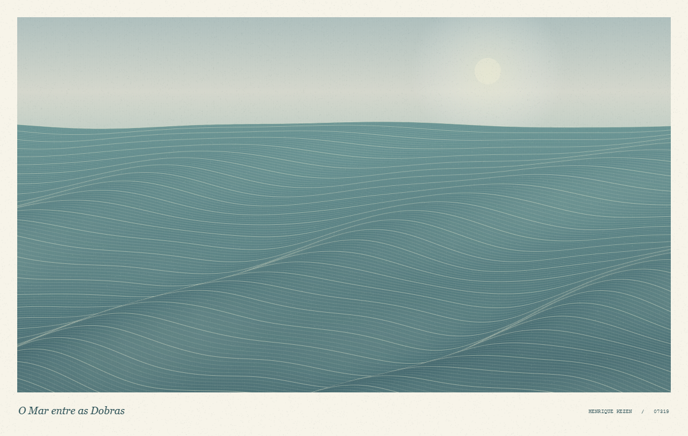

# O Mar entre as Dobras

> Há um instante em que a dobra de um tecido parece guardar um oceano.

**Autor:** Henrique Kezen  
**Linguagem:** JavaScript, com p5.js  
**Categoria:** arte generativa interativa  
**Desenvolvimento:** Henrique Kezen, com assistência de IA na elaboração do código e da documentação.

## Descrição

Uma paisagem marítima que também pode ser vista como um tecido em movimento. Camadas de ondas se sobrepõem como pregas: linhas claras acompanham as cristas, enquanto sombras azuis e verdes dão profundidade às dobras. O ritmo lento convida a observar pequenas mudanças na superfície.

O movimento combina ondas senoidais e ruído suave. Ao passar o mouse sobre a imagem, o observador altera delicadamente a água, como se uma corrente de ar tocasse o tecido. Duas paletas permitem experimentar diferentes atmosferas, e cada nova composição modifica o desenho das ondas. A moldura clara e a tipografia completam a apresentação como uma pequena gravura animada.

## Inspiração e relação com a obra

A referência principal é [*Under Dark (R Code)*, publicada na comunidade r/generative do Reddit em 16 de julho de 2022](https://www.reddit.com/r/generative/comments/w08ygj/).

Na publicação, o criador explica que a obra começou com a observação de sombras em cortinas e evoluiu para uma paisagem oceânica. O trabalho utiliza painéis verticais e ondas senoidais como base para polígonos com formato de ondas.

Essa passagem entre um objeto cotidiano e uma paisagem é o ponto de partida de **O Mar entre as Dobras**. As faixas sobrepostas e os contornos retomam a associação visual entre tecido, sombra e água. Aqui, a interpretação ganha animação contínua, variações orgânicas, interação pelo mouse e duas atmosferas de cor. A referência orienta o conceito e a construção em camadas; a composição foi desenvolvida para este sketch em p5.js.

## Prompt de criação

> Crie um sketch interativo em p5.js chamado “O Mar entre as Dobras”, de Henrique Kezen. Imagine que um tecido extenso e delicado se transforma lentamente em oceano: suas pregas tornam-se ondas, as sombras revelam profundidade e cada fio de luz desenha uma crista. Parta da relação entre cortinas e paisagem marítima apresentada em “Under Dark (R Code)”, publicado no r/generative, e desenvolva uma interpretação própria dessa ideia.
>
> Construa a paisagem com muitas camadas de curvas orgânicas, combinando funções senoidais e ruído suave. Varie a altura, a largura e o espaçamento das ondas para sugerir distância e volume. Use azuis profundos, verdes azulados e reflexos claros, quase prateados. Ofereça também uma segunda paleta, com a sensação mais quente do entardecer. Faça as curvas se moverem devagar, como um tecido que respira, preservando a continuidade e a sensação de calma.
>
> O mouse deve provocar uma perturbação local e delicada na superfície. Inclua controles para pausar e retomar a animação, alternar a paleta, gerar uma nova composição e salvar a imagem em PNG. Apresente a obra dentro de uma moldura clara, com título e instruções discretas. A imagem deve ser interessante tanto em movimento quanto como uma gravura estática. Gere todos os elementos visuais por código, sem imagens externas ou áudio. Importe apenas p5.js por CDN e mantenha o pacote de entrega pequeno.

## Como executar

1. Extraia o arquivo ZIP para uma pasta.
2. Abra `index.html` em um navegador atualizado.
3. Mantenha a conexão com a internet para carregar p5.js pelo CDN.

## Interação

| Controle | Ação |
| --- | --- |
| Mover o mouse sobre a obra | Perturbar suavemente as ondas próximas ao cursor. |
| Botão de pausa ou **Espaço** | Pausar ou retomar a animação. |
| Botão de paleta ou **C** | Alternar as duas atmosferas de cor. |
| **R** | Gerar uma nova composição. |
| **S** | Salvar a imagem atual em PNG. |

## Arquivos da entrega

- `index.html`: página de entrada e importação de p5.js pelo CDN.
- `style.css`: apresentação e adaptação da página à tela.
- `sketch.js`: desenho generativo, animação e controles.
- `README.md`: descrição, autoria, referência e prompt de criação.
- `thumbnail.png`: imagem representativa gerada pelo próprio sketch.

O pacote não contém cópias locais de p5.js nem de p5.sound. O sketch não utiliza áudio e não importa p5.sound.
