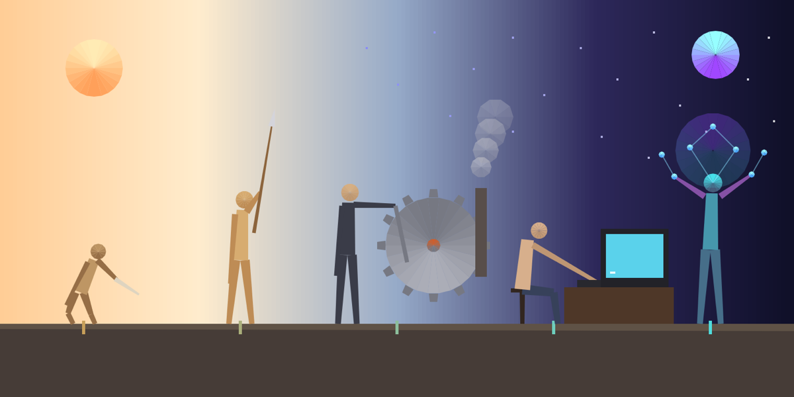

# Marcha Digital — Desenho com Quadriláteros

**Autor:** Victor Hugo Figueiredo Pereira da Silva

**Artefato da semana 01** — tema: *desenho com quadriláteros* (primitiva `quad` do p5.js)

## Ideia do trabalho

O sketch é uma releitura semiabstrata da famosa ilustração **"A Marcha do
Progresso"** (aquela sequência em que uma figura vai, passo a passo, se
tornando mais ereta e mais alta). Aqui a marcha vai da **Idade da Pedra**
até a **fusão do ser humano com a Inteligência Artificial**, mostrando a
evolução das ferramentas e da tecnologia que o ser humano usa.

Da esquerda para a direita, as 5 estações da marcha são:

1. **Hominídeo agachado com um osso** — a primeira ferramenta da história (Idade da Pedra).
2. **Homo erectus com uma lança** — ferramenta composta e postura ereta.
3. **Trabalhador da Revolução Industrial** — máquina a engrenagem, alavanca e chaminé.
4. **Pessoa em frente ao computador** — a era digital pessoal.
5. **Fusão humano + Inteligência Artificial** — corpo com gradiente "digital" e um halo de rede neural (nós conectados por cabos) pairando sobre a cabeça.

Dois recursos visuais reforçam a ideia de evolução, como na imagem original:
a postura das figuras fica cada vez mais ereta e a altura aumenta a cada
estação; e o céu passa de um amanhecer quente e terreno (à esquerda, Idade
da Pedra) para uma "noite digital" neon, com estrelas que viram pontinhos
de dado (à direita, era da IA).

## Prompt utilizado

Segui o modelo de prompt sugerido no enunciado, adaptado para descrever a
ideia acima:

> Crie um sketch estático (sem animação) em p5.js, em um único script
> JavaScript pronto para colar no editor.p5js.org. Use apenas a primitiva
> `quad` para desenhar (estilização com `stroke`, `fill`, `strokeWeight`
> etc. é permitida). Tema: uma arte semiabstrata inspirada na icônica
> imagem "A Marcha do Progresso", mostrando a evolução das ferramentas e
> da tecnologia usadas pelo ser humano — da Idade da Pedra até uma figura
> fundida com inteligência artificial — em estilo low-poly, com paleta de
> cores evoluindo de tons terrosos para tons digitais neon. Comente o
> código para iniciantes em programação.

## Regra técnica (só `quad`)

A única primitiva de desenho usada em todo o sketch é `quad()`. Não há
`ellipse`, `rect`, `line` ou `triangle` em nenhum lugar do código — inclusive
os "círculos" (cabeças, engrenagem, sol, halo de dados) e os "retângulos"
(monitor, mesa, chão) são construídos combinando vários quadriláteros
pequenos:

- `quadRect(x, y, w, h)` — um retângulo é só um quadrilátero com 4 ângulos retos.
- `quadLimb(x1, y1, x2, y2, w1, w2)` — desenha um "membro" afunilado entre
  dois pontos (braço, perna, lança, cabo, alavanca...). Quando a largura
  numa das pontas é `0`, o quadrilátero degenera numa ponta bem fina — é
  assim que a ponta de lança e os "cabos" da rede neural são desenhados.
- `quadDisc(cx, cy, r, segments, corA, corB)` — aproxima um círculo
  fatiando-o em vários quadriláteros bem finos (como pedaços de pizza),
  usado nas cabeças, na engrenagem, no sol e no halo de IA.

O sketch é **estático**: todo o desenho acontece uma única vez dentro de
`setup()`, e `noLoop()` garante que nada seja redesenhado depois — por isso
não existe função `draw()` no arquivo.

O código-fonte (`sketch.js`) está comentado em português, pensado para ser
explicado a uma plateia iniciante em programação.

## Como executar

1. Abra [editor.p5js.org](https://editor.p5js.org).
2. Cole o conteúdo de `sketch.js` no editor.
3. Rode o sketch (▶). A imagem é desenhada uma única vez, sem animação.

(Também é possível abrir `index.html` diretamente no navegador — ele já
carrega o p5.js e o `sketch.js`.)

## Arquivos deste pacote

- `sketch.js` — o script p5.js (única primitiva de desenho: `quad`).
- `index.html` — página simples para rodar `sketch.js` fora do editor.
- `thumbnail.png` — imagem representativa do resultado gerado pelo sketch.
- `README.md` — este arquivo.
