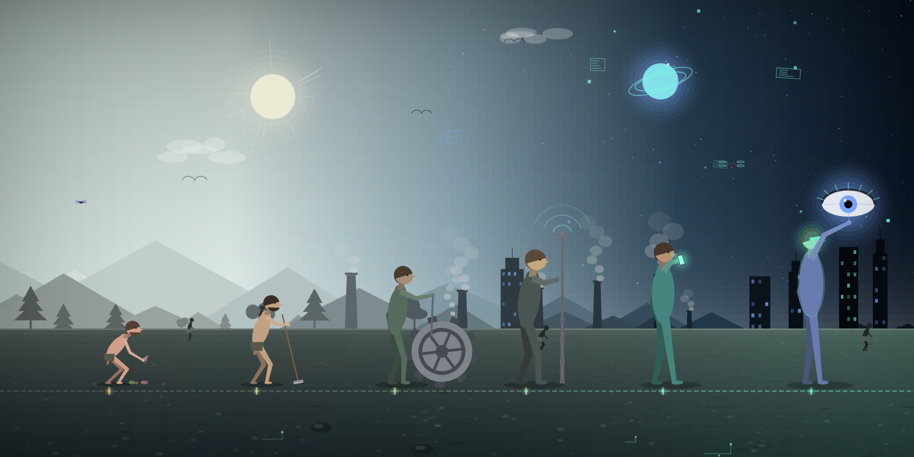

# A Marcha Generativa do Progresso

**Autor:** Victor Hugo Figueiredo Pereira da Silva

**Artefato da semana 02** — extensão do trabalho da semana 01, agora com
qualquer primitiva vista em sala, com **aleatoriedade** e com **canvas do
tamanho da janela**.



## Ideia do trabalho

Na semana passada eu desenhei "A Marcha do Progresso" usando **só** a primitiva
`quad`: um quadro fixo, com cinco figuras fixas, que era sempre exatamente o
mesmo. Esta semana o mesmo tema virou um **sistema generativo**: em vez de
desenhar *uma* marcha do progresso, o sketch desenha *uma máquina que inventa
marchas do progresso*. Cada execução sorteia uma história diferente da
humanidade — da Idade da Pedra até a era da Inteligência Artificial — e a
compõe na janela disponível.

A leitura é sempre da esquerda para a direita, como na ilustração original:

- a **postura** vai do hominídeo agachado até a figura completamente ereta;
- a **altura** das figuras cresce a cada etapa;
- a **ferramenta** de cada figura fica mais complexa (osso → lança → roda →
  engrenagem → lâmpada → celular → rede neural);
- o **céu** viaja de um amanhecer quente para uma noite digital cheia de
  estrelas, bits e blocos de dados;
- a **paisagem de fundo** se transforma junto: as árvores da esquerda vão
  virando chaminés no meio e arranha-céus acesos na direita.

O detalhe conceitual de que eu mais gostei é que a postura e a altura de cada
figura são calculadas a partir da **era** que ela representa, e não da posição
dela na fila. Como as eras sorteadas sempre saem em ordem crescente, a marcha
continua funcionando visualmente com 3 ou com 7 estações — e um operário da
Revolução Industrial nunca aparece agachado como um hominídeo só porque o
sorteio o colocou na segunda posição.

## A parte da aleatoriedade

O sketch **não gera a mesma imagem duas vezes**. No começo de tudo ele sorteia
uma **semente** (um número inteiro) e a usa em `randomSeed()` / `noiseSeed()`.
A semente aparece na legenda do canto, então qualquer imagem gerada pode ser
reencontrada depois.

O que é sorteado a cada execução:

| O que muda | Como |
| --- | --- |
| Atmosfera | 5 paletas (Amanhecer, Poeira Vermelha, Névoa Fria, Crepúsculo Ácido, Azul Profundo) + um desvio de cor em cada canal, para que duas execuções da mesma paleta nunca sejam idênticas |
| Nº de estações | 3 a 7, calculado a partir do formato da janela |
| Eras presentes | a Idade da Pedra e a era da IA são fixas (são as pontas da marcha); as do meio são sorteadas e ordenadas |
| Ferramenta de cada era | 3 objetos possíveis por era = **21 ferramentas** desenhadas no código |
| As figuras | altura, postura, espessura dos membros, tamanho da cabeça, abertura das pernas, ângulo do tronco, tom de pele e cor da roupa |
| Cenário | montanhas, árvores, chaminés, torres com janelas acesas, nuvens, blocos de dados, estrelas, pássaros, drones, multidão de fundo, pedras e trilhas de circuito no primeiro plano |
| Composição | altura do horizonte, posição da linha dos pés, posição e tamanho do sol e do orbe digital |

Um detalhe que valeu a pena: sementes vizinhas (1, 2, 3…) começam com números
pseudoaleatórios parecidos, então logo depois de semear o sketch descarta os
12 primeiros sorteios para "aquecer" o gerador. Sem isso, sementes próximas
geravam imagens suspeitosamente parecidas.

Para gerar uma nova imagem basta **clicar** (ou apertar qualquer tecla).

## A parte do tamanho da janela

Não existe **nenhuma** medida em pixels fixos no desenho:

```js
function setup() {
  createCanvas(windowWidth, windowHeight);   // canvas = janela
  ...
}

function windowResized() {
  resizeCanvas(windowWidth, windowHeight);   // ao redimensionar, refaz o desenho
  redraw();
}
```

Todo o resto é calculado em `calcularLayout()` como fração de `width` /
`height`: a altura do horizonte, a linha do chão, a largura da "vaga" de cada
figura, a altura das figuras, o tamanho das montanhas, a espessura das linhas
e até o corpo da letra da legenda (que encolhe sozinho se não couber na
largura da janela).

O número de estações também responde ao espaço: janelas largas ganham mais
etapas da história (até 7), janelas estreitas ficam com as 3 mínimas — e nesse
caso as figuras recebem um fator de ampliação para não virarem formiguinhas.
Assim o sketch funciona tanto em um monitor ultrawide quanto em uma janela
vertical de celular, sem esticar nem cortar o desenho.

## Primitivas usadas

Diferente da semana passada (que era `quad` e nada mais), aqui as primitivas
são combinadas livremente:

| Primitiva | Onde aparece |
| --- | --- |
| `rect` | degradês do céu e do chão, prédios, mesas, telas, blocos de dados, vinheta |
| `circle` | cabeças, juntas, rodas, engrenagens, lâmpada, nós da rede neural, halos |
| `ellipse` | troncos (elipse girada), nuvens, fumaça, sombras, hélices de drone, pedras |
| `line` | raios de sol, alavancas, treliça da antena, raios da roda, conexões da rede neural, faíscas |
| `triangle` | montanhas, pinheiros, pontas de lança e de flecha, chamas, cone de luz do celular |
| `quad` | membros afunilados (braços, pernas, hastes), tangas, base da chaminé |
| `arc` | arco de caça, alças do vaso, cabelo e barba, ondas de rádio, anéis do orbe, asas dos pássaros, olho da IA |
| `point` | estrelas e o grão da imagem |
| `text` | apenas a legenda do canto (o desenho em si não usa texto) |

As funções auxiliares `membro()`, `bastao()`, `brilho()`, `fumaca()` e
`engrenagemForma()` só existem para não repetir a mesma conta de geometria
várias vezes — internamente elas são feitas dessas mesmas primitivas.

O sketch é **estático**: `noLoop()` no `setup()` garante que a imagem é
desenhada uma única vez. `draw()` existe (em vez de tudo dentro de `setup()`)
justamente para que `redraw()` possa refazer a obra quando a janela muda de
tamanho ou quando o usuário pede uma nova composição.

## Controles

| Tecla / ação | Efeito |
| --- | --- |
| clique do mouse | gera uma nova marcha (nova semente) |
| qualquer tecla | gera uma nova marcha |
| `S` | salva a imagem atual em PNG |
| `H` | mostra / esconde a legenda do canto |
| redimensionar a janela | refaz a mesma obra no novo tamanho |

## Como executar

1. Abra o arquivo `index.html` diretamente no navegador (ele já carrega o
   p5.js e o `sketch.js`), **ou**
2. cole o conteúdo de `sketch.js` no [editor.p5js.org](https://editor.p5js.org)
   e rode (▶).

## Prompt utilizado (Claude Code, modelo Opus 5, esforço máximo)

> Estenda o meu artefato da semana passada ("A Marcha do Progresso", feita só
> com `quad`) para um sketch **generativo** em p5.js, podendo usar todas as
> primitivas vistas em sala. Requisitos: (1) o sketch não pode gerar sempre a
> mesma imagem — use uma semente aleatória por execução e sorteie paleta,
> número de estações, eras, ferramentas, proporções das figuras e todo o
> cenário; (2) não use tamanho fixo — crie o canvas com
> `windowWidth`/`windowHeight`, derive todas as medidas do tamanho da janela e
> reaja a `windowResized()`; (3) a leitura da marcha (postura ficando ereta,
> altura crescendo, ferramentas evoluindo, céu indo do amanhecer à noite
> digital) tem que continuar legível com qualquer número de estações; (4)
> comente o código em português, pensando em quem está começando a programar.

Depois disso, o resultado foi ajustado a partir de renderizações de teste em
vários tamanhos de janela e várias sementes: correção da cabeça que afundava
nos ombros, curva de postura por era, degradês do céu e do chão redesenhados
como grade opaca (as faixas com transparência sobrepostas criavam listras),
vinheta sem anéis, e um teste automático que renderiza as 21 ferramentas e 10
formatos de janela procurando erros de execução.

## Arquivos deste pacote

- `sketch.js` — o sketch p5.js (comentado em português).
- `index.html` — página para rodar o sketch fora do editor.
- `thumbnail.png` — uma das imagens geradas pelo sketch (semente 4242).
- `README.md` — este arquivo.
