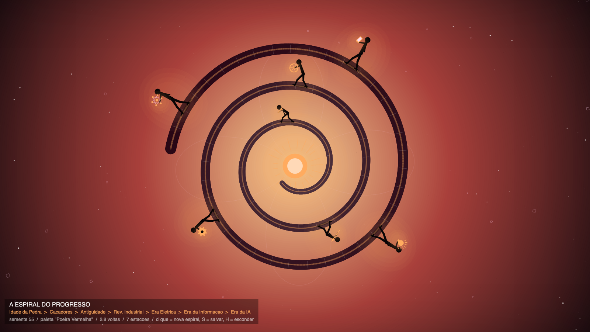

# A Espiral do Progresso

**Autor:** Victor Hugo Figueiredo Pereira da Silva

**Artefato da semana 03** — extensão dos trabalhos das semanas 01 e 02, agora
seguindo uma **especificação geométrica** de posição, dimensões e inclinação /
direção (aula 3: *Posição, direção e tamanho*).

## Ideia do trabalho

Nas semanas anteriores a marcha do progresso caminhava em linha reta, da
esquerda para a direita. Esta semana ela foi **enrolada numa espiral**: o
tempo nasce no sol do centro (a Idade da Pedra) e desenrola para fora, volta
após volta, até a era da Inteligência Artificial — que caminha na borda
escura, entre estrelas e bits. A estrada do tempo é uma **espiral de
Arquimedes**, e as figuras das semanas passadas continuam lá, com a mesma
postura que evolui de curvada para ereta e as mesmas ferramentas que evoluem
de osso a rede neural.

## A especificação geométrica (o requisito da semana)

Nada na imagem é posicionado "no olho" — cada elemento obedece a uma regra
explícita de posição, dimensão ou direção, usando exatamente as ferramentas
da aula 3:

**Posição — coordenadas polares.** A estrada, as figuras, os raios do sol,
as estrelas e os bits são todos colocados por um par (ângulo, raio) medido a
partir do centro, convertido para x/y com `p5.Vector.fromAngle()`. A espiral
é `r(θ) = lerp(rIn, rMax, θ/θmax)` — o raio cresce em linha reta com o
ângulo, que é a definição da espiral de Arquimedes. As estações **não** são
espaçadas por ângulo, e sim por **comprimento andado**: o sketch amostra a
espiral em 1200 pontos, acumula um "odômetro" e crava cada figura numa fração
da distância total (perto do centro uma volta é curtinha; na borda, longa —
por ângulo o espaçamento ficaria injusto).

**Dimensões — `map()` + `constrain()` + `lerp()`.** O tamanho é função do
raio: quanto mais longe do centro (mais adiante no tempo), maior a figura,
mais larga a estrada e maior a ferramenta — tudo com `map(raio, rIn, rMax,
mín, máx)`, e `constrain()` garantindo que ninguém bata a cabeça na volta de
cima da espiral. As cores do céu interpolam com `lerpColor()` do amanhecer
(centro) para a noite digital (borda), desenhadas como anéis concêntricos —
um degradê **radial**, não vertical.

**Inclinação / direção — vetores + transformações.** Nenhuma figura fica "em
pé" em relação à tela: cada uma é perpendicular à estrada no ponto em que
pisa (na parte de baixo da espiral elas aparecem de cabeça para baixo, como
quem anda ao redor de um pequeno planeta). A direção da estrada é o **vetor
tangente** (diferença entre dois pontos vizinhos da amostragem), o ângulo vem
de `.heading()` e o giro é feito com `translate()` + `rotate()` + `scale()`
entre `push()` e `pop()`. Um **produto escalar** (`.dot`) confere se a cabeça
da figura aponta para fora da espiral; se não, um `rotate(PI)` + `scale(-1,1)`
espelham a figura sem inverter o sentido da caminhada. Os tracinhos da
estrada (os "dormentes" da ferrovia do tempo) usam o mesmo truque, girados
90° em relação à tangente.

De sobremesa, uma **rosácea** — `r(θ) = R·|cos(k·θ/2)|`, direto dos slides —
aparece bem de leve ao fundo, atravessada pela espiral.

## A parte da aleatoriedade

Como nas semanas anteriores, o sketch **não gera a mesma imagem duas vezes**:
sorteia uma **semente** por execução (`randomSeed()` / `noiseSeed()`), mostra
o número na legenda e "aquece" o gerador descartando os primeiros sorteios.
O que muda a cada execução:

| O que muda | Como |
| --- | --- |
| Atmosfera | 5 paletas (Amanhecer, Poeira Vermelha, Névoa Fria, Crepúsculo Ácido, Azul Profundo) + desvio de cor por canal |
| A espiral | número de voltas (conforme o espaço da janela + sorte), sentido (horário/anti-horário) e fase inicial |
| Eras presentes | 5 a 7 estações; Idade da Pedra e era da IA são fixas nas pontas, as do meio são sorteadas e ordenadas |
| As figuras | altura, postura, passada e dobra do joelho vêm da era; a inclinação vem do ponto da espiral |
| Cenário | rosácea (nº de pétalas e giro), raios do sol, estrelas, bits girados e o grão da imagem |

Para gerar uma nova espiral basta **clicar** (ou apertar qualquer tecla).

## A parte do tamanho da janela

O canvas continua sendo `createCanvas(windowWidth, windowHeight)` com
`windowResized()` refazendo a **mesma** obra (mesma semente) no novo formato.
Todas as medidas derivam do lado mais apertado da janela, e o raio máximo da
espiral **desconta a altura da figura mais externa** — como as figuras ficam
de pé apontando para fora, sem essa folga a última teria a cabeça cortada
pela borda. Janelas maiores ganham mais voltas e mais estações; janelas
estreitas ficam com espirais de menos voltas, para o vão entre as voltas não
esmagar as figuras.

## Primitivas usadas

| Primitiva | Onde aparece |
| --- | --- |
| `circle` | anéis do céu, sol, halos, cabeças, juntas, roda, engrenagem, lâmpada, nós da rede neural |
| `line` | corpo da estrada (segmento a segmento), raios do sol, dormentes, raios da roda, conexões da rede |
| `quad` | membros afunilados (tronco, braços, pernas) e os pés |
| `rect` | bits girados, osso, haste da lança, dentes da engrenagem, celular, rosca da lâmpada, vinheta |
| `triangle` | ponta da lança |
| `ellipse` | halo e sombra das figuras |
| `point` | grão da imagem |
| `vertex` | a curva da rosácea |
| `text` | apenas a legenda do canto |

## Controles

| Tecla / ação | Efeito |
| --- | --- |
| clique do mouse | gera uma nova espiral (nova semente) |
| qualquer tecla | gera uma nova espiral |
| `S` | salva a imagem atual em PNG |
| `H` | mostra / esconde a legenda do canto |
| redimensionar a janela | refaz a mesma obra no novo tamanho |

## Como executar

1. Abra o arquivo `index.html` diretamente no navegador (ele já carrega o
   p5.js e o `sketch.js`), **ou**
2. cole o conteúdo de `sketch.js` no [editor.p5js.org](https://editor.p5js.org)
   e rode (▶).

## Prompt utilizado (Claude Code, modelo Fable 5, esforço alto)

> Baseado nos últimos dois trabalhos, entregue o zip completo para o trabalho
> abaixo: esta semana, seu artefato deverá seguir algum tipo de especificação
> geométrica em termos de posição, dimensões ou inclinação / direção
> (conceitos da aula de hoje — posição, direção e tamanho: `lerp`, `map`,
> `constrain`, coordenadas polares, vetores e transformações). Como sempre, a
> submissão deve ser um único arquivo zip com o sketch em p5.js, sem pastas
> dentro do zip. Lembre de fazer sempre o desenho aleatório generativo, que
> muda nas execuções.

Depois disso, o resultado foi ajustado a partir de renderizações de teste em
vários tamanhos de janela e várias sementes: verificação de que cada figura
fica perpendicular à estrada com a cabeça para fora (e caminhando no sentido
do tempo mesmo quando a espiral é espelhada), e a correção do raio máximo da
espiral, que descontou a altura das figuras para nenhuma cabeça ser cortada
pela borda da janela.

## Arquivos deste pacote

- `sketch.js` — o sketch p5.js (comentado em português).
- `index.html` — página para rodar o sketch fora do editor.
- `thumbnail.png` — uma das imagens geradas pelo sketch (semente 55).
- `README.md` — este arquivo.
