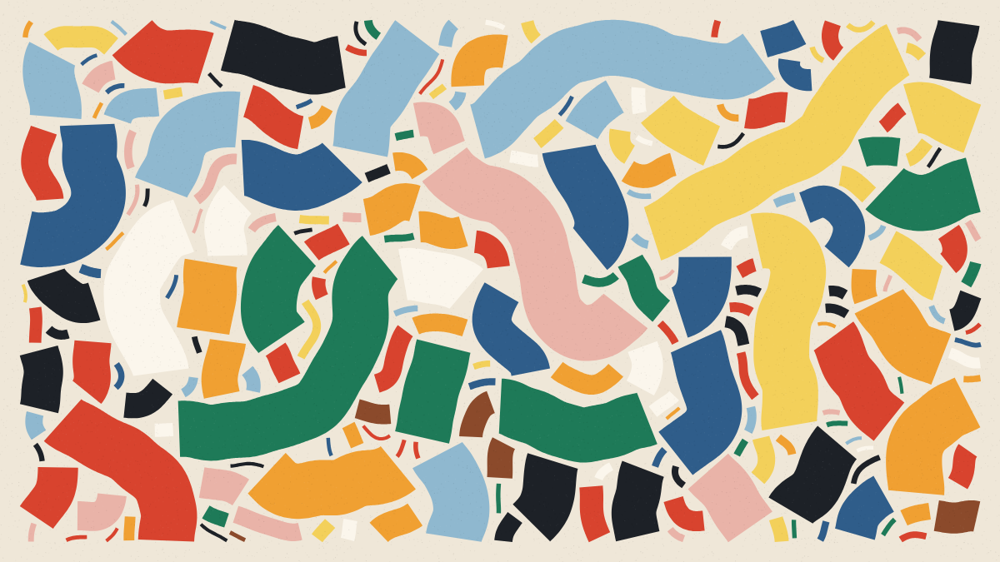

# Correnteza

**Autor:** Victor Hugo Figueiredo Pereira da Silva

**Artefato da semana 04** — um sketch generativo em p5.js inspirado numa obra
encontrada em redes sociais / páginas web.

## Obra de inspiração

**Tyler Hobbs — *Fidenza* (2021)**

- Instagram do artista: <https://www.instagram.com/tylerxhobbs/>
- Texto do artista sobre a obra: <https://www.tylerxhobbs.com/words/fidenza>
- Texto do artista sobre a técnica usada (campos de fluxo):
  <https://www.tylerxhobbs.com/words/flow-fields>
- A coleção completa (999 imagens geradas pelo algoritmo):
  <https://www.artblocks.io/collection/fidenza-by-tyler-hobbs>

Tyler Hobbs é um artista generativo de Austin (EUA) que trabalha com
algoritmos, plotters e tinta. *Fidenza* é o trabalho mais conhecido dele: um
único algoritmo que gerou 999 imagens diferentes, todas feitas de **faixas
grossas e curvas que seguem um campo de fluxo e nunca se sobrepõem**. O que
chamou minha atenção no Instagram dele foi o equilíbrio entre controle e
acaso: cada imagem é imprevisível, mas todas são claramente "da mesma
família".

## A ligação entre *Correnteza* e *Fidenza*

*Correnteza* não copia o código de Hobbs (ele não é aberto). O sketch foi
escrito do zero a partir das explicações que o próprio artista publicou nos
dois textos acima, recriando as mesmas ideias:

| Em *Fidenza* (Tyler Hobbs) | Em *Correnteza* (este sketch) |
| --- | --- |
| **Campo de fluxo**: uma grade cobre a tela e cada célula guarda um ângulo, geralmente vindo do ruído de Perlin | `construirCampo()` monta a grade (`Float32Array`) e `anguloDoFluxo()` calcula o ângulo de cada célula com `noise()` |
| As curvas andam passo a passo seguindo o ângulo da célula em que estão | `caminhar()` dá passinhos de 0,25% do menor lado da tela, para frente e para trás a partir de um ponto sorteado |
| **Formas sem sobreposição**: antes de avançar, a curva confere se não vai encostar em outra | uma segunda grade, a de ocupação, marca onde já há tinta; `cabeAqui()` testa uma linha atravessando a faixa a cada passo |
| **Três regras de colisão** ("No Overlap", sobreposição parcial, "Anything Goes") | `sem sobreposição`, `meio a meio` e `vale-tudo` |
| **Turbulência** baixa / média / alta / nenhuma, **espiral** e **ângulos agudos** (múltiplos de 0,2·π) | fluxos `suave`, `ondulado`, `turbulento`, `reto`, `espiral` e `quebrado` (este arredonda o ângulo para múltiplos de 0,2·π, como em Fidenza) |
| **Escalas** Small, Medium, Large, Jumbo, Jumbo XL, Uniform, Micro-Uniform | `pequena`, `média`, `grande`, `jumbo`, `jumbo XL`, `uniforme`, `micro` |
| **Estilos**: formas sólidas, *Super Blocks* (a faixa vira um mosaico de blocos coloridos), *Outline* e *Soft Shapes* (milhares de linhas paralelas com ruído) | `sólido`, `blocos` (mosaico de `quad`s), `contorno` e `pincel` (fios paralelos meio transparentes, tremidos com `noise()`) |
| **Paletas probabilísticas**: cada paleta e cada cor dentro dela têm uma chance diferente de aparecer | 7 paletas com peso, e cores com peso dentro de cada uma, sorteadas por `sortearComPeso()` |
| Formas "divididas", que trocam de cor no meio | às vezes a faixa é cortada em 2 ou 3 trechos de cores diferentes |
| **Margem** em volta da imagem | margem `larga`, `fina` ou `sangrada` (as formas vazam pela borda) |

### O que é diferente (a minha contribuição)

- **As paletas são brasileiras e minhas**: *Feira*, *Ipanema*, *Azulejo*,
  *Cerrado* e *Carnaval*. Duas são homenagens diretas às paletas de uma cor
  só de Fidenza: *Creme* (lembra a "White on Cream") e *Nanquim* (lembra a
  "Black").
- **A obra é pintada na frente de quem assiste.** Fidenza aparece pronta; em
  *Correnteza* dá para ver a pintura crescer forma por forma, em cerca de 6
  segundos (o computador faria isso em menos de um décimo de segundo, então o
  sketch distribui o trabalho de propósito ao longo de ~420 quadros). As
  formas grandes escolhem lugar primeiro e as pequenas vão preenchendo os
  vãos, como quem enche um pote com pedras, depois pedrinhas, depois areia.
- **Regra de curvatura**: faixas grossas não fazem curvas mais fechadas do que
  a própria espessura (senão a faixa "dobraria" por cima de si mesma). Por
  isso, num fluxo turbulento as faixas grossas saem curtas e as finas saem
  longas e sinuosas.
- **Grão de papel** passado por cima no final, para a imagem digital parecer
  impressa.
- A **legenda** mostra as características sorteadas, como a página de cada
  Fidenza mostra as "features" da imagem.

## A parte da aleatoriedade

Cada execução sorteia uma **semente** (mostrada na legenda), e todas as
características saem dela. A mesma semente sempre gera a mesma obra. A
semente passa por uma pequena função de *hash* (`embaralhar()`) antes de
chegar ao `randomSeed()`, porque o gerador do p5 dá resultados quase iguais
para sementes vizinhas.

| Característica | Opções (da mais comum para a mais rara, aproximadamente) |
| --- | --- |
| Paleta | Feira, Ipanema, Azulejo, Cerrado, Carnaval, Creme, Nanquim |
| Fluxo | suave, ondulado, espiral, quebrado, turbulento, reto |
| Escala | jumbo, grande, média, uniforme, pequena, micro, jumbo XL |
| Estilo | sólido, pincel, blocos, contorno |
| Colisão | sem sobreposição, meio a meio, vale-tudo |
| Curvas | médias, longas, curtas |
| Margem | fina, larga, sangrada |

Clique para gerar uma obra nova.

## A parte do tamanho da janela

O canvas é `createCanvas(windowWidth, windowHeight)` e **todas** as medidas
(passo, espessuras, folga entre formas, margem, resolução das grades) são
proporcionais ao menor lado da janela. Ao redimensionar, `windowResized()`
repinta a **mesma** obra (mesma semente) no novo formato.

## Primitivas e recursos usados

| Recurso | Onde aparece |
| --- | --- |
| `beginShape` / `vertex` / `endShape` | as faixas sólidas e de contorno (sobe por um lado da espinha, volta pelo outro) e os fios do estilo pincel |
| `quad` | os blocos do estilo mosaico |
| `point` | o grão de papel |
| `rect` / `text` | a legenda |
| `noise()` | o campo de fluxo e o tremor dos fios de pincel |
| `createGraphics()` | a camada onde a pintura acontece (a legenda fica por cima, no canvas principal) |
| `atan2`, `sin`, `cos`, vetores normais | direção das curvas, espiral e espessura das faixas |

## Controles

| Tecla / ação | Efeito |
| --- | --- |
| clique do mouse ou `N` | nova obra (nova semente) |
| `ESPAÇO` | termina de pintar na hora (pula a animação) |
| `R` | repinta a obra atual desde o começo |
| `S` | salva a imagem em PNG |
| `H` | mostra / esconde a legenda |
| redimensionar a janela | repinta a mesma obra no novo tamanho |

## Como executar

1. Abra o arquivo `index.html` no navegador. Ele carrega **apenas** a
   biblioteca p5.js pelo CDN (sem p5.sound e sem cópia local da biblioteca)
   e o `sketch.js`. **Ou**
2. cole o conteúdo de `sketch.js` no [editor.p5js.org](https://editor.p5js.org)
   e rode (▶).

## Prompt utilizado (Claude Code, modelo Opus 5)

> Use redes sociais e páginas web para obter inspiração para o seu próximo
> artefato. Nos metadados do seu sketch (arquivo README.md) inclua um (ou
> mais) links para a(s) obra(s) que usou como inspiração. Esclareça a ligação
> entre o seu sketch e a obra usada. [...] na formatação pedida e conhecida,
> porém me mande o link de pelo menos 5 obras para eu escolher 3 para você se
> inspirar.

A IA sugeriu nove obras (Georg Nees, Vera Molnár, Frieder Nake, Bridget
Riley, Anni Albers, Tyler Hobbs, Kjetil Golid, Manolo Gamboa Naon e Zach
Lieberman). Escolhi Tyler Hobbs com o segundo prompt:

> Use as artes de Tyler Hobbs para se inspirar. Aqui está o Instagram dele
> para você mencionar: https://www.instagram.com/tylerxhobbs/

Depois disso, o resultado foi ajustado a partir de renderizações de teste com
várias sementes, estilos e tamanhos de janela. Por exemplo, foi aí que surgiu
a função `embaralhar()`: as primeiras sementes testadas (1 a 6) saíam todas
com a mesma escala.

## Arquivos deste pacote

- `sketch.js` — o sketch p5.js (comentado em português).
- `index.html` — página para rodar o sketch fora do editor.
- `thumbnail.png` — uma das imagens geradas pelo sketch.
- `README.md` — este arquivo.
