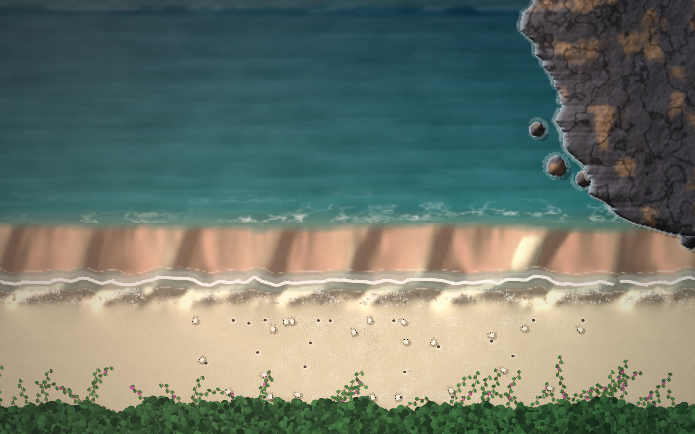

# Cúspides de Itacoatiara

**Autor:** Victor Hugo Figueiredo Pereira da Silva

**Artefato da semana 06** — tema: *Emergência* (a partir da aula 5, *Agentes*).



## Ideia do trabalho

A praia de Itacoatiara, na Região Oceânica de Niterói, vista de cima, como numa
foto de drone: o mar verde-azulado, o costão de granito com seus matacões, a
faixa de areia molhada onde a onda sobe e desce, a areia seca onde as
marias-farinha cavam as tocas e, no pé da imagem, a restinga com a salsa-da-praia
rastejando em direção ao mar.

Itacoatiara é uma praia de tombo: íngreme, de areia grossa e mar forte. Em
praias assim aparece um desenho curioso na beira d'água: a linha da praia deixa
de ser reta e se enruga numa fileira de **meias-luas quase do mesmo tamanho**,
com "chifres" de areia apontando para o mar e baías cavadas entre eles. São as
**cúspides de praia**. Ninguém as desenha: elas surgem da conversa entre a água
e a areia, onda após onda. Esse é o assunto do trabalho.

O sketch começa com uma praia **perfeitamente lisa**. Depois de umas mil ondas
as cúspides aparecem sozinhas, e o próprio programa conta quantas surgiram e
**mede** o espaçamento entre elas. Ele precisa medir porque não sabe a resposta:
esse número não está escrito em lugar nenhum do código.

## Emergência (a parte técnica do trabalho)

Emergência é quando um padrão global surge da interação de regras locais
simples, sem que o programador tenha desenhado ou previsto esse padrão. O teste
mais simples é: **procure no código a coisa que aparece na tela**. Não existe
nenhuma função que desenhe meia-lua, nenhuma variável chamada "espaçamento das
cúspides", nenhuma posição de toca escolhida por mim e nenhuma "onda de susto".
Existem só três tipos de agente, cada um com regras que olham apenas para a
vizinhança:

| agente | estado | regra (só local) | rastro | o que emerge |
| --- | --- | --- | --- | --- |
| **parcela de água** (480 por onda) | posição, velocidade, areia carregada | sente a inclinação do chão, freia com o atrito, copia um pouco a velocidade das vizinhas, arranca areia quando corre e larga quando freia | o próprio relevo da praia | as **cúspides**, com espaçamento regular |
| **bolha de espuma** | posição, idade | nasce onde uma parcela para de subir e vai sumindo | pontinhos brancos, marcas de espraiamento, linha de algas | os **arcos de espuma** que contornam chifres e baías |
| **maria-farinha** | posição, toca, medo | passeia perto da toca; se a toca de outra estiver perto demais, muda-se e cava outra; foge de gente e de vizinha que corre | pegadas e montinhos de areia | **tocas espaçadas** por igual e uma **onda de susto** que atravessa a praia |

É a mesma tabela "estado + regra + rastro" do fim dos slides da aula 5. A
diferença é que aqui o rastro de um agente vira o chão por onde os próximos vão
andar.

Mas "não está no código" é um teste fraco: um padrão pode não estar escrito e
mesmo assim estar escondido num parâmetro. Por isso fiz uma **auditoria com
experimentos** (mais abaixo), desligando uma regra de cada vez.

### 1. As cúspides: um laço de realimentação

Cada onda é um punhado de 480 parcelas soltas juntas na linha da arrebentação,
subindo a rampa. A regra da areia é uma frase só: **água rápida aguenta carregar
mais areia do que água lenta**.

```js
const vel = Math.hypot(o.vx[i], o.vy[i]);
const troca = TROCA * (K_AREIA * vel - o.areia[i]) * DT;
espalhar(o.px[i], o.py[i], -troca); // tira areia do chão (ou devolve, se troca < 0)
o.areia[i] += troca;
```

Se a parcela carrega menos do que aguenta, arranca areia do chão (erosão); se
carrega mais, larga (deposição). A partir daí acontece um laço que eu não
programei:

1. uma imperfeição na areia desvia um pouquinho a água;
2. a água desviada se junta nas partes baixas, onde volta mais rápido e **cava
   mais**; nas partes altas ela se espalha, freia e **deposita**;
3. o baixo fica mais baixo e o alto fica mais alto, e o desvio da próxima onda
   é maior.

Isso é **realimentação positiva**: sozinha, ela faria a praia desmoronar. Quem
segura o crescimento (**realimentação negativa**) é a areia escorregando um pouco
depois de cada onda (`assentarAreia()`). Do equilíbrio entre as duas sai um
tamanho preferido, e é ele que a praia escolhe.

**O espaçamento acompanha a força do mar.** Mudando só a força do mar (setas
↑↓), a água sobe mais ou menos, e o espaçamento muda junto:

| força do mar | a água sobe (medido) | espaçamento medido | espaçamento ÷ subida |
| --- | --- | --- | --- |
| 34 | 21 m | 23 m | 1,1 |
| 42 | 25 m | 23 m | 0,9 |
| 50 | 29 m | 27 m | 0,9 |
| 58 | 32 m | 30 m | 0,9 |

*(média de 4 sementes cada, numa praia de 360 m e com 3 000 ondas)*

O espaçamento fica em torno de **0,9 vez o alcance da água**. É o que se observa
em praias de verdade, onde o espaçamento das cúspides acompanha até onde a água
sobe. Em nenhum lugar do código eu escrevi essa relação: nem a subida real (o
atrito e o próprio relevo decidem) nem o espaçamento.

**Como o programa mede.** Ele pega as linhas do meio do espraiamento e decompõe
o relevo ao longo da praia em ondas de vários comprimentos (uma transformada de
Fourier, em `medirCuspides()`). Se um comprimento domina, é o espaçamento que a
praia escolheu. Com a tecla **V** aparece o **espectro**: no começo ele é
achatado (ruído), e aos poucos um pico isolado se levanta.

Um cuidado: como a praia emenda nas bordas e tem 240 m, só cabem números
inteiros de cúspides. Por isso o espaçamento mostrado pula entre 240/11 ≈ 22,
240/10 = 24, 240/9 ≈ 27 e 240/8 = 30 m.

### 2. A espuma, as marcas de espraiamento e a linha de algas

Cada parcela, no instante em que para de subir, deixa uma bolha de espuma e um
pouco de "detrito". Quando a onda visível acaba, o ponto mais alto que a água
atingiu em cada coluna vira uma **marca de espraiamento**: a linha fina de
espuma e grãos que fica na areia. Uma onda nova que sobe mais apaga as marcas
antigas por onde passa. Como a água é desviada pelos chifres, essas linhas saem
em **arcos que desenham as cúspides**. A frente da onda que sobe também é traçada
assim, ligando a parcela mais adiantada de cada coluna. A linha de algas escuras
é a soma de milhares de pontos de parada. Nenhum desses contornos é desenhado.

### 3. As marias-farinha

As marias-farinha começam **todas amontoadas** num pedaço da praia. Cada uma só
conhece a toca mais próxima: se ela estiver a menos de 16 m, a caranguejo se
muda para o lado oposto e cava outra. Ninguém calcula "onde deveria ficar cada
toca", mas depois de um minuto elas estão espalhadas pela praia inteira, com
distâncias parecidas entre si (a tecla **V** mostra o território de cada uma).

O mouse é uma pessoa caminhando pela areia, deixando pegadas. A marias-farinha
que vê a pessoa (a até 13 m) corre para a toca, **congela na boca da toca por um
instante** e mergulha. As que veem uma vizinha correndo ou congelada (a até
24 m) também se assustam, mas com atraso (12% de chance por quadro). Por causa
desse atraso **o susto viaja pela praia como uma onda**, bem mais longe do que o
alcance da visão de qualquer uma delas.

### O que é emergente e o que é cenário

- **Emergente:** o relevo da praia (cúspides), a espuma no topo do espraiamento,
  as marcas de espraiamento, a frente da onda, a linha de algas, a umidade da
  areia (as baías, mais baixas, ficam molhadas por mais tempo), o espaçamento
  das tocas e a onda de susto.
- **Cenário (desenhado, não emergente):** as cristas no mar (elas só marcam a
  hora em que a próxima onda visível nasce), a ondulação e o brilho do sol na
  água, o costão, os matacões, a restinga com a salsa-da-praia.
- **Recursos de exibição:** a onda que se vê é uma onda de verdade do modelo em
  câmera lenta, e entre uma e outra o modelo roda umas setenta ondas escondidas
  (um timelapse), senão as cúspides levariam meia hora para aparecer; **ESPAÇO**
  acelera ainda mais. O relevo é pintado com **exagero vertical** (como num mapa
  topográfico), porque as cúspides do modelo têm dezenas de centímetros de
  altura e sem exagero a luz quase não as mostraria.

## Auditoria de emergência

Para não depender só do "não está no código", rodei o próprio `sketch.js` fora
do navegador (Node.js, com um p5 simulado) e fiz **experimentos de ablação**:
desligar uma regra de cada vez e ver se o padrão some. Cada linha abaixo é a
média de 3 sementes, com 2 500 ondas. "Crescimento" é quantas vezes o relevo
cresceu desde a areia inicial; "regularidade" é a fração do relevo que está no
pico do espectro (0 = ruído, 1 = senoide perfeita).

| experimento | espaçamento | crescimento | regularidade | conclusão |
| --- | --- | --- | --- | --- |
| modelo normal | 27–30 m | ×6 | 0,55 | cúspides regulares |
| **sem realimentação** (a água não sente o relevo que ela mesma cava) | — | ×1 | — | **nada surge**: o padrão nasce do laço |
| **sem a areia escorregar** (`DIFUSAO = 0`) | — | ×2 000 | 0,06 | a praia desmorona em valas: a realimentação negativa é essencial |
| realimentação forte demais (`K_AREIA = 0.03`) | 240 m | ×38 | — | a praia vira uma única vala gigante |
| sem mistura entre parcelas (`MISTURA = 0`) | 27 m | ×4 | 0,55 | as cúspides surgem igual, só mais baixas: a mistura **não** é essencial |
| vizinhança da mistura de 2 ou de 4 células | 22–30 m | ×5–7 | 0,5–0,6 | o espaçamento não vem do tamanho da grade |
| praia de 300 m em vez de 240 m | 25–27 m | ×4 | 0,4 | o espaçamento não vem do tamanho da praia (numa de 180 m, 2 de 3 sementes deram 26–30 m e uma travou num modo longo de 90 m) |
| **areia 100% lisa** no início | 24–27 m | — | 0,46 | surge mesmo assim: basta o acaso de onde cada parcela nasce |
| **padrão de 60 m imposto** na areia inicial | 22–30 m | — | 0,46 | **a praia desobedece** e escolhe o próprio espaçamento |
| **padrão de 12 m imposto** na areia inicial | 24–30 m | — | 0,57 | idem |

Os dois últimos são os mais fortes. Mesmo quando eu tento impor um espaçamento,
a praia o esquece e volta para ~27 m. O espaçamento é uma propriedade do
**sistema** (regras + força do mar), não da condição inicial nem de qualquer
número que eu tenha escolhido.

Para as marias-farinha medi o **índice de Clark-Evans** (distância média até a
toca vizinha, dividida pelo que se esperaria se as tocas estivessem espalhadas
ao acaso: R < 1 = amontoadas, R = 1 = acaso, R > 1 = regulares) e o alcance do
susto, com a pessoa parada perto de uma só marias-farinha:

| momento | R (Clark-Evans) | quantas fogem | até onde o susto chega |
| --- | --- | --- | --- |
| início (amontoadas) | 0,27 | 100% | ~40 m |
| depois de 90 s (espalhadas) | 1,5 | ~90% | ~80 m |

A pessoa enxerga 13 m e assusta **uma** caranguejo; o susto chega a 80 m. Esse
alcance não está em lugar nenhum: é uma reação em cadeia.

**O que a auditoria corrigiu.** Ela encontrou três problemas, todos consertados
nesta versão:

1. **A onda de susto morria.** Com o raio de contágio antigo (9 m), depois que
   as marias-farinha se espalhavam (tocas a ~13 m umas das outras) só 3% delas
   fugiam: a cadeia se quebrava no primeiro elo. Com 18 m, ~50% fugiam; com 24 m,
   ~90%. É um **limiar de percolação**: abaixo de uma certa densidade de
   vizinhas visíveis o susto não se propaga, acima dele varre a praia. Nenhuma
   regra fala disso. Também acrescentei o "congelar na boca da toca", que as
   marias-farinha fazem de verdade: sem ele a caranguejo assustada sumia antes de
   alguém vê-la.
2. **O README antigo dizia que a mistura entre parcelas segurava o crescimento.**
   O experimento mostrou que não: sem mistura as cúspides surgem igual. Quem
   segura é só a areia escorregando.
3. **O sombreamento estava invertido desde a primeira versão:** morros
   apareciam como buracos, e os chifres das cúspides pareciam baías. Não mudava
   a simulação, mas mentia sobre ela.

**Honestidade sobre os limites.**

- As tocas das marias-farinha são o exemplo **fraco** de emergência: a
  *regularidade* emerge (ninguém escolhe as posições), mas a *distância* entre
  elas (~13–16 m) é herdada do raio da regra (`RAIO_TOCA = 16`). Já nas
  cúspides nem a regularidade nem a distância estão em parâmetro nenhum: é o
  exemplo forte.
- O perfil médio da praia é mantido fixo (depois de cada onda cada linha volta à
  altura média da rampa original). É uma regra imposta, para a praia não
  "derreter" para o mar. Os experimentos acima mostram que ela não escolhe o
  espaçamento, mas é uma simplificação.
- As cúspides quase sempre nascem **tortas**, inclinadas para um lado. Nada no
  código prefere um lado: a simetria se quebra sozinha e cada semente escolhe o
  seu. Nas praias de verdade elas costumam ser mais simétricas; o modelo é uma
  caricatura.

## O que a semente sorteia

- a **hora do dia**, entre três paletas: `amanhecer` (areia molhada refletindo
  o céu rosado), `meio-dia` (mar turquesa, luz alta) e `fim de tarde` (dourado,
  luz vindo do outro lado);
- a **força do mar**, que decide até onde a água sobe e, por consequência, o
  espaçamento das cúspides;
- as imperfeições iniciais da areia;
- quantas marias-farinha há e onde começa o amontoado;
- o desenho do costão, dos matacões e da restinga.

Um detalhe chato: o gerador do p5 é um LCG simples, e sementes vizinhas (1, 2,
3...) davam sequências tão parecidas que quase todas caíam na mesma paleta. A
função `semear()` passa a semente por um misturador de bits antes de usá-la.

## Controles

| tecla / gesto | o que faz |
| --- | --- |
| mover o mouse | uma pessoa caminha pela praia (as marias-farinha fogem) |
| arrastar o mouse | risca a areia com um graveto, para ver a praia se reorganizar |
| `↑` / `↓` | mar mais forte / mais fraco (o espaçamento das cúspides muda sozinho) |
| `ESPAÇO` | liga / desliga o timelapse acelerado |
| `V` | mostra o mecanismo: velocidade das parcelas, territórios, raios de susto, a faixa de medição e o **espectro da areia** |
| `N` | nova praia (nova semente) |
| `H` | mostra / esconde a legenda |
| `S` | salva a imagem em PNG |

Pela URL também dá para escolher a semente e já começar com a praia formada,
por exemplo `index.html?semente=2&ondas=2500` (foi assim que tirei a thumbnail).

## Como executar

1. Abra o arquivo `index.html` no navegador. Ele carrega **apenas** a biblioteca
   p5.js pelo CDN (sem p5.sound e sem cópia local) e o `sketch.js`. **Ou**
2. cole o conteúdo de `sketch.js` no [editor.p5js.org](https://editor.p5js.org)
   e rode (▶).

O canvas ocupa a janela inteira. Numa tela deitada a praia inteira (240 m) cabe
na largura; numa tela em pé o sketch dá um zoom e mostra um pedaço, e como a
praia emenda nas bordas, tanto faz qual.

## Plano de desenvolvimento (no lugar do prompt)

Desta vez, no lugar do prompt, coloco o plano que foi montado antes de escrever
o código e seguido durante o desenvolvimento (com Claude Code).

**1. Entender o pedido.** Reler os slides da aula 5 (*Agentes*), principalmente
o slide "Emergência por deposição" (*você escreve o processo; o resultado é uma
consequência que muitas vezes você não consegue prever de cabeça, só rodando*)
e a tabela final "estado + regra + rastro". O projeto não precisa usar agentes,
mas precisa ter um padrão que ninguém desenhou.

**2. Fazer o levantamento da galeria.** Ler título e descrição de todos os
artefatos já postados pela turma, para não repetir tema. Na semana 4 já existe
um bando de boids (*Enxame Noturno*) e um mar-tecido (*O Mar entre as Dobras*);
na semana 5, mofo e o meu próprio micélio. Conclusão: nada de boids, nada de
fungo e nada de "mar bonito" sem mecanismo.

**3. Escolher um fenômeno emergente real da praia de Itacoatiara.** A pergunta
foi: o que acontece em Itacoatiara que ninguém desenha? Três respostas, que
viraram as três camadas do trabalho:
- as **cúspides de praia**, típicas de praias íngremes e de mar forte (o
  principal);
- a **espuma** que o espraiamento deixa na areia;
- as **marias-farinha**, com suas tocas espaçadas e a fuga em cadeia quando
  alguém passa.

**4. Provar que a emergência acontece antes de desenhar qualquer coisa.**
Prototipar o modelo das cúspides em Python (NumPy), sem nenhuma preocupação
visual, olhando só o mapa de desvios da areia. Critérios de aceitação: (a)
partindo de uma praia lisa, surge uma fileira regular de chifres e baías;
(b) o espaçamento muda quando só a força do mar muda. Resultado: os dois
primeiros modelos (erosão crescendo com o quadrado da velocidade) fizeram poços
redondos, não cúspides; o terceiro (erosão proporcional à velocidade, areia
espalhada entre as quatro células vizinhas) passou nos dois critérios.

**5. Portar para p5.js e montar a cena**, de baixo para cima:
- a areia é uma grade de 240 × 100 células (1 célula ≈ 1 m), pintada numa
  imagem com 2 × 2 pixels por célula, com sombreamento pela inclinação do
  relevo, areia molhada mais escura espelhando o céu, marolinhas de vento na
  areia seca e a linha de algas;
- o mar tem profundidade, manchas de fundo, ondulação chegando, água turva perto
  da areia, espuma rendada na arrebentação, cristas que quebram e brilho do sol;
- a onda visível é desenhada com a linha de espuma da frente, bolhas e uma
  película d'água por trás; ao terminar ela deixa a sua marca de espraiamento;
- o costão de granito e os matacões são desenhados uma vez só, com relevo
  arredondado, líquen, fendas e a faixa molhada e brilhante junto da água;
- a restinga na base, com a salsa-da-praia e suas flores roxas;
- as marias-farinha com a camuflagem cor de areia, pegadas e tocas;
- o mouse como uma pessoa que deixa pegadas, apagadas quando a água passa;
- uma vinheta com a luz quente vindo do lado do sol.

**6. Tornar a emergência visível e verificável:** um contador de ondas, a
medição automática do espaçamento, a tecla V para mostrar o mecanismo e o
espectro por baixo da imagem (como os slides sugerem), e as setas para o
espectador mudar a força do mar e ver o espaçamento mudar.

**7. Testar olhando o resultado**, não só vendo se compila: rodar em várias
sementes e tamanhos de tela (inclusive celular em pé), capturar telas, ajustar e
repetir. As correções que mais mudaram a imagem: o espraiamento real (medido) era
bem menor que o nominal; a película d'água virava bolhas e precisou ser
borrada; a onda visível durava menos de um segundo e passou para câmera lenta;
as paletas só saíam iguais até a semente passar pelo misturador; e o
sombreamento estava invertido.

**8. Auditar a emergência** com experimentos de ablação (seção acima): desligar
cada regra, trocar o tamanho da praia e da vizinhança, impor padrões falsos na
areia inicial e medir o espaçamento e a regularidade. Corrigir o que a
auditoria mostrou que não se sustentava.

**9. Entregar** no formato de sempre (`sketch.js`, `index.html`, `thumbnail.png`,
`README.md`) e **com o zip sem pasta dentro**: os quatro arquivos direto na raiz
do zip.

## Arquivos deste pacote

- `sketch.js` — o sketch p5.js (comentado em português).
- `index.html` — página para rodar o sketch fora do editor.
- `thumbnail.png` — uma das imagens geradas pelo sketch (paleta *amanhecer*,
  semente 2, com a onda subindo e contornando as cúspides).
- `README.md` — este arquivo.
