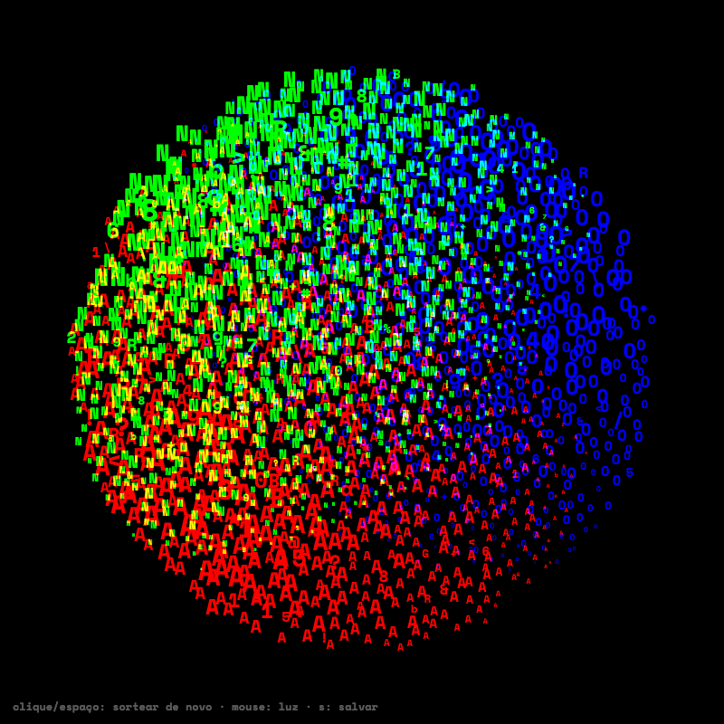

# Esfera Tipográfica RGB

**Autor:** Victor Hugo Figueiredo Pereira da Silva

**Artefato da semana 07** — tema: *Tipografia* (imagem feita com texto).

Feito com o auxílio de IA (**AI**, **Claude**).

## Homenagem

Conheci o trabalho do artista **Adam Fuhrer** (<https://adamfuhrer.com>) e uma das obras que mais me chamaram a atenção foi a série de esferas em meio-tom RGB (*rgb halftone sphere*, 2026). Reproduzi-la a meu modo, usando só letras, é a minha maneira de homenagear o autor. A ideia e o visual são dele; a escolha de trocar os pontos por tipografia é minha leitura para o tema da semana.

## Ideia do trabalho

Na obra original, uma esfera é desenhada por pontos de meio-tom (*halftone*) em três canais de cor, vermelho, verde e azul, somados como luz. Aqui cada ponto é uma **letra**:

- o canal vermelho é feito só de **R**;
- o verde, só de **G**;
- o azul, só de **B**.

O **tamanho da letra** é a "quantidade de tinta": onde o canal recebe muita luz a letra é grande, onde recebe pouca ela encolhe até sumir. Onde as três letras se sobrepõem, as cores se somam e a esfera clareia até o branco.

## Parte técnica

- Cada canal tem sua própria grade de letras, **girada num ângulo diferente** (15°, 75° e 45°), como nas telas de impressão de uma gráfica. Isso gera o padrão de moiré.
- Cada canal é iluminado por uma luz que gira num ritmo próprio. Por isso as cores se separam nas bordas do brilho.
- **Aleatoriedade:** a cada carregamento (e a cada clique) o sketch sorteia uma semente com os ângulos das grades, as velocidades das luzes, quanto a superfície é amassada (ruído de Perlin), quanto cada letra treme de posição, quanto varia de tamanho, quantas somem e quantas viram letras intrusas. O acaso de cada letra vem de um hash estável, então não pisca entre quadros.
- A esfera é calculada com a normal de cada ponto (luz difusa mais um brilho especular suave).
- As cores são somadas com `globalCompositeOperation = "lighter"`, que imita luz.
- A fonte (Space Mono Bold) é carregada de um CDN com `loadFont` do p5.js 2. Nenhum arquivo de fonte nem a biblioteca p5.js estão no zip.

## Controles

| ação | efeito |
| --- | --- |
| mover o mouse | puxa as três luzes para a posição do mouse |
| clique ou espaço | sorteia tudo de novo (letras, ângulos, luzes, amassado, falhas) |
| `s` | salva um PNG |

## Como executar

Abra o `index.html` num navegador com internet (o p5.js e a fonte vêm de CDN), ou cole `sketch.js` no editor do p5js.org (versão 2).

## Plano de desenvolvimento

1. **Escolher a obra.** Entre as obras do Adam Fuhrer, ficar com a esfera em meio-tom RGB, que se presta bem a virar texto: o "ponto" do meio-tom vira uma letra.
2. **Modelar a esfera.** Para cada ponto dentro do círculo, calcular a normal `(x, y, √(1−x²−y²))` e a luz recebida.
3. **Três telas de meio-tom.** Criar uma grade de pontos por canal, cada uma girada num ângulo diferente.
4. **Trocar pontos por letras.** Desenhar R, G e B com o tamanho proporcional à raiz da luz recebida, centralizadas na grade.
5. **Mistura aditiva.** Usar o modo de composição `lighter` sobre fundo preto, para as cores somarem como luz.
6. **Animar.** Uma luz por canal, girando em fases diferentes, e a grade girando devagar para o moiré mudar.
7. **Interação e ajuste fino.** Mouse como luz, clique para sortear tudo de novo (aleatoriedade por letra com hash estável), ajuste do tamanho das letras para continuarem legíveis.
8. **Regras de entrega.** p5.js 2 via CDN, fonte via CDN, README com as palavras-chave e a coleção.

## Arquivos

- `index.html`: página que carrega o p5.js 2 do CDN.
- `sketch.js`: o código do sketch.
- `thumbnail.png`: captura do resultado.
- `README.md`: este arquivo.
