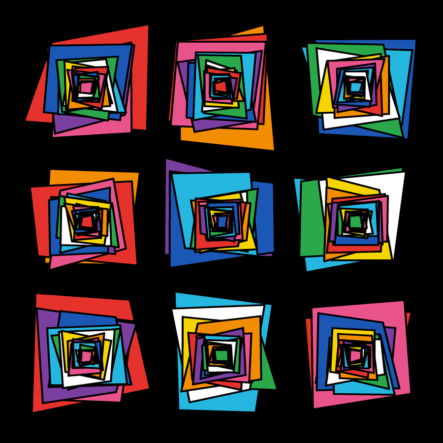

# Artefato 2 — Quadriláteros Aninhados

**Autor:** Murilo Jorge de Figueiredo



## Descrição

Sketch estático em **p5.js** que usa **exclusivamente a primitiva `quad()`** como
comando de desenho. Os demais comandos são apenas de estilização (`fill`,
`stroke`, `strokeWeight`, `strokeJoin`, `background`) e de sorteio (`random`,
`randomSeed`).

A regra construtiva é simples e cabe em duas frases:

> Sorteamos 4 pontos aleatórios dentro de um quadrado de lado **n** e ligamos os
> quatro com um `quad()`. Em seguida o quadrado **encolhe** (`n` vira
> `n × FATOR`) e tudo se repete — de modo que cada quadrilátero só pode nascer
> em um espaço **menor** do que o do anterior.

Como o espaço de sorteio nunca cresce, cada forma cai necessariamente dentro da
região da anterior. Empilhadas, as camadas produzem um túnel que gira para
dentro: o acaso decide a forma de cada peça, mas a regra de encolhimento decide
a estrutura inteira. A tela é dividida em uma grade 3 × 3 e cada célula recebe
uma pilha independente — mesma regra, sorteios diferentes.

## Como funciona

1. **O quadrado de sorteio.** A cada camada existe um quadrado imaginário
   centrado em (cx, cy) e de lado `n`. Ele nunca é desenhado; serve apenas para
   delimitar onde os pontos podem cair.

2. **Os 4 pontos.** Cada vértice é sorteado em um **canto** desse quadrado: o
   vértice superior esquerdo só pode cair numa caixinha junto ao canto superior
   esquerdo, e assim por diante. Duas consequências: os pontos ficam sempre em
   ordem ao redor do centro (o quadrilátero nunca se cruza em forma de
   gravata-borboleta) e cada forma sai como um quadrado amassado, e não como um
   triângulo espetado. O parâmetro `CANTO` controla o tamanho dessas caixinhas —
   ou seja, quanta liberdade o acaso tem.

3. **O encolhimento.** Depois de desenhar, faz-se `n = n × FATOR`. Com
   `FATOR = 0.89`, cada camada perde 11% do lado. É uma progressão geométrica:
   ao fim de 20 camadas o quadrado tem cerca de 10% do tamanho inicial.

4. **A cor.** Cada pilha sorteia um ponto de partida na paleta e caminha por ela
   uma cor por camada, o que produz a sensação de rotação cromática para dentro.
   O contorno preto grosso separa as camadas e faz a sobreposição ficar legível.

5. **Determinismo.** `randomSeed(SEMENTE)` garante que o sorteio seja sempre o
   mesmo — o desenho é aleatório, mas reprodutível.

## Como executar

**Opção 1 — editor online:** abra <https://editor.p5js.org>, cole o conteúdo de
`sketch.js` e clique em *Play*.

**Opção 2 — local:** abra o arquivo `index.html` no navegador (ele já carrega o
p5.js por CDN).

Com o sketch rodando, aperte a tecla **S** para salvar um PNG da imagem.

## Experimente mudar

Todos os parâmetros estão no topo do `sketch.js`, comentados um a um:

- `SEMENTE` — troque o número e todos os pontos mudam, no mesmo estilo.
- `FATOR` — perto de 1 o quadrado encolhe devagar e as camadas se sobrepõem
  muito; perto de 0.7 o desenho mergulha rápido para o centro.
- `CANTO` — 0.2 dá quadriláteros quase quadrados e comportados; 1.0 dá formas
  retorcidas e pontudas.
- `CAMADAS` — a profundidade do túnel.
- `GRADE` — 1 devolve uma única pilha gigante ocupando toda a tela; 5 ou 6
  transformam o desenho em um mosaico de pilhas pequenas.

## Arquivos

```
sketch.js       o sketch em p5.js, comentado para iniciantes
index.html      página para rodar o sketch localmente
thumbnail.png   imagem representativa do resultado
README.md       este arquivo
```
