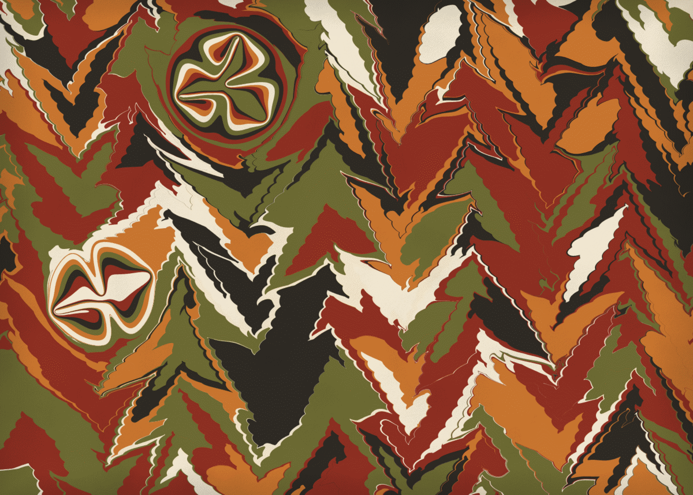

# Ebru — um banho de tinta que se penteia sozinho

**Autor:** João Galetti
**Artefato da semana 5** — "inspiração negativa": fazer algo diferente de tudo
que apareceu nos artefatos 1 a 4.



Cada execução prepara uma bandeja de água, deixa cair algumas centenas de gotas
de tinta e trabalha o banho com estilete e pente até virar uma folha de papel
marmorizado. Você assiste ao processo: as gotas caem uma a uma, os traços
aparecem e apagam, o desenho se forma. No fim a folha é batizada com o nome
turco do padrão que saiu.

- **clique** — começa uma folha nova
- **arraste sobre a folha pronta** — passa o estilete com a própria mão
- **barra de espaço** — termina a folha na hora
- **s** — salva a folha em PNG

---

## A ideia

Ebru é a marmorização turca: pinga-se tinta na superfície de uma água engrossada
com goma, trabalha-se o desenho com uma agulha e um pente, e encosta-se o papel
para tirar a folha. O que me interessou é que **o artesão nunca desenha nada**.
Ele só desloca o que já está lá. Não existe traço, não existe pincelada: existe
uma mancha redonda e existem empurrões.

Isso vira um sistema generativo quase direto. Cada gesto do artesão é um **mapa
do plano**, aplicado ao mesmo tempo a todos os pontos de todas as gotas que já
estão na bandeja. Nada neste sketch é desenhado a mão: **toda curva que você vê
é um círculo que foi empurrado**.

## Os quatro gestos

```
gota(C, r)     P' = C + (P−C)·√(1 + r²/|P−C|²)
estilete       P' = P + M·u·α^(d/λ)            d = distância à reta do gesto
arrasto        estilete pontual gaussiano, avançando passo a passo
redemoinho     rotação em torno de C decaindo com exp(−r²/2σ²)
```

A primeira é a que importa. É a solução exata de "abrir espaço para um disco de
raio *r* sem comprimir nada": o ponto que estava a distância *u* do centro vai
para √(u²+r²). O mapa **preserva área** — e é por isso que a tinta antiga não
some quando cai uma gota nova: ela afina e vira um anel. A folha inteira é um
arquivo estratigráfico, com a ordem dos acontecimentos legível nas espessuras.
A flor (*hatip*) é construída explorando isso: seis a dez gotas **do mesmo
tamanho no mesmo ponto**, cada uma empurrando a anterior para fora, produzem os
anéis concêntricos; depois a ponta é puxada do centro para fora e de fora para
o centro, alternando, e os anéis abrem em pétalas.

O `α` do estilete é o parâmetro que separa o carinho do estrago. Perto de 1 o
campo arrasta a bandeja inteira e homogeneíza tudo; perto de 0 ele corta. A
faixa que produz aquelas arcadas aninhadas do pente é estreita e só apareceu
depois de muita tentativa.

## A gramática dos padrões

O sketch não sorteia "um desenho". Ele sorteia uma **receita**, na ordem em que
um artesão trabalharia:

| etapa | o que é |
|---|---|
| **battal** (*zemin*) | o chão de gotas. Sem ele não há ebru: todo o resto é deformação deste tapete |
| **gel-git** | "vai e vem" — estiletes paralelos, alternando o sentido |
| **şal** | "xale" — um gel-git cruzado com o anterior |
| **taraklı** | o pente fino, dezenas de dentes de uma vez só |
| **bülbül yuvası** | "ninho de rouxinol" — a ponta girando em espiral |
| **hatip** | a flor do pregador, pingada por cima do desenho já pronto |

Em cerca de uma folha a cada oito a bandeja é japonesa em vez de turca e o que
se faz é um **suminagashi**: gotas alternadas de tinta e de água com tensoativo
no mesmo ponto, formando dezenas de anéis concêntricos, depois ondulados por
um sopro. A gota de água é maior que a de tinta — é isso que deixa o traço de
tinta fino e o vão largo, como no papel japonês.

## O que deu trabalho

O bonito da marmorização está na **nitidez das bordas**, e manter isso custa:

- **Refino adaptativo.** Cada operação estica umas partes do contorno e comprime
  outras. Depois de cada gesto, todo polígono é percorrido inserindo vértice
  onde a aresta passou de ~2 px e descartando vértice onde os pontos se
  amontoaram. Sem isso, as bordas viram polígonos em duas ou três passadas.
- **Orçamento de pontos.** Uma folha chega a 200 mil vértices. Quando passa do
  teto, o refino afrouxa sozinho em vez de a animação travar.
- **A bandeja tem fundo.** No plano infinito do computador a tinta foge e o chão
  nunca fecha. Medindo a fração de água descoberta ao longo da receita, dá para
  mostrar que o que fecha a bandeja é o **volume** de tinta, não o número de
  gotas: por isso a primeira leva é graúda e a leva vai afinando — que é também
  a ordem da bancada real. Sobra menos de 2% de água à vista.
- **Rejeição por caixa.** Arrasto e redemoinho são gestos locais; testar a caixa
  envolvente antes de calcular a gaussiana derruba o custo de um gesto de
  ~200 mil pontos para alguns milhares, e é o que segura o tempo real.
- **Vizinhança truncada no pente.** Um pente de 50 dentes seriam 50 exponenciais
  por vértice. Como o campo decai rápido, só os 4 dentes de cada lado importam.
- **Semente embaralhada.** O gerador do p5 é uma congruência linear: as sementes
  101 e 102 devolvem primeiros sorteios quase iguais e escolhiam sempre a mesma
  paleta. Um hash inteiro antes de semear resolve.

## Sobre a "inspiração negativa"

Passei a lista dos artefatos 1 a 4 da turma inteira antes de começar, para saber
o que **não** fazer. Os temas que mais se repetiram foram:

cidades e skylines · paisagens com pôr do sol, estrada e montanha · mandalas,
espirais e composições radiais · grades e quadrados à la Mondrian / Vera Molnár
/ Schotter · campos de fluxo no estilo Fidenza · espaço, estrelas e planetas ·
túneis em perspectiva · flores e jardins · vitrais e mosaicos · fan art de
personagens · homenagens a artistas generativos conhecidos · tipografia
distorcida.

Este sketch não é nenhuma dessas coisas. Não tem grade, não tem campo de fluxo,
não tem partícula, não tem cena, não tem centro radial e não homenageia nenhum
artista generativo. O tema é um **ofício** — uma técnica de papel do século XV —
e o algoritmo é a física dela, não uma imitação do resultado dela. E é o único
caminho que eu conheço em que a imagem inteira é uma só deformação contínua de
um punhado de círculos.

Também é diferente do meu próprio artefato 4 (uma carta náutica de uma ilha
fictícia): lá o processo era erosão sobre uma grade de alturas e o resultado era
um documento; aqui não existe grade nenhuma — tudo é contorno vetorial — e o
resultado é um objeto, uma folha.

## Arquivos

- `sketch.js` — o sketch em p5.js.
- `index.html` — roda o sketch e mostra o código.
- `thumbnail.png` — uma das folhas.

Feito com p5.js, sem nenhuma biblioteca além dela.

---

**João Galetti** · Programação Criativa · Artefato 5
