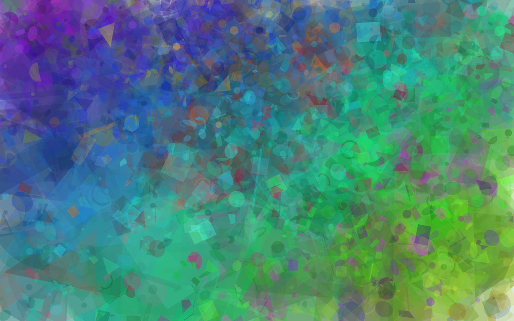

# Camadas — acúmulo de figuras translúcidas

**Autor:** Murilo Jorge de Figueiredo



## Descrição

Sketch estático em **p5.js** que usa **todas as primitivas de desenho** vistas em
aula: `rect`, `ellipse`, `triangle`, `quad`, `arc`, `line` e `point`.

A premissa é que **nenhuma figura sozinha faz nada**. Cada uma é pequena, torta,
girada por um ângulo qualquer e quase transparente. Mas alguns milhares delas,
jogadas umas por cima das outras, vão somando cor até o branco do fundo
desaparecer por completo. A imagem final não é desenhada — ela é **acumulada**.
O que se vê são as sobreposições: onde duas dezenas de figuras coincidem, a cor
satura e a região ganha peso; onde poucas se cruzam, sobra um véu leve.

O sketch **se adapta ao tamanho da janela** e **não usa semente fixa**: cada
execução produz um quadro inédito. Redimensionar a janela, clicar ou apertar
**R** gera outro na hora.

## As três camadas

O desenho é construído da mais grossa para a mais fina:

| Camada | Quantidade¹ | Tamanho² | Opacidade | Função |
|---|---|---|---|---|
| **Fundo** | 260 | 25%–55% | 40–85 | mata o branco de uma vez |
| **Meio** | 700 | 7%–22% | 25–60 | cria as manchas e o clima de cor |
| **Detalhe** | 3000 | 1%–6% | 40–95 | dá textura e granulação |

¹ para uma janela de referência de 1280 × 800; o número real é reescalado pela
área da janela, de modo que a densidade visual seja a mesma numa tela pequena e
num monitor grande.
² como fração do **menor** lado da janela — usar o menor lado (e não a largura)
é o que faz o design se encaixar bem tanto em janela deitada quanto em pé.

Só a camada de fundo é espalhada **por igual**: é ela que precisa garantir que
não sobre nenhum canto branco. As outras duas podem se aglomerar à vontade,
porque já estão pintando sobre cor.

## As duas decisões que salvaram o quadro

Na primeira versão, tudo era sorteado de forma uniforme e o resultado era uma
papa cinzenta homogênea — tecnicamente correta e visualmente morta. Duas
mudanças resolveram:

**1. A cor depende de ONDE a figura está.** Existe um matiz base e uma direção,
ambos sorteados a cada execução. Ao caminhar nessa direção pelo quadro, o matiz
escorrega pela roda de cores — um lado fica roxo, o outro verde. Sobre esse
gradiente cada figura ainda varia um pouco, e 18% delas saltam para o lado
oposto da roda (a cor complementar): são os acentos que fazem a massa de cor
vibrar em vez de estagnar.

**2. As figuras se aglomeram.** Sete focos são sorteados a cada execução. 62%
das figuras caem perto de um deles, com desvio dado por `randomGaussian()` —
perto do foco é muito provável, longe é raro mas possível. Os outros 38%
continuam espalhados, para que nenhuma região fique órfã. O resultado são
regiões densas e regiões arejadas, ou seja, composição.

Um detalhe menor, mas que importa: as posições podem cair **fora** da tela. As
figuras vazam pelas bordas de propósito — sem isso o quadro ganha uma moldura
invisível de figuras alinhadas na margem.

## Notas de implementação

- `push()` / `pop()` isolam a rotação de cada figura. Sem eles, o giro de uma
  contaminaria todas as seguintes.
- As figuras cheias vão **sem contorno**: um `stroke` somaria linhas escuras
  demais quando milhares se empilham.
- `line` e `point` são as únicas que usam `stroke` — e um `point` com
  `strokeWeight` grande vira uma bolinha macia, que é como ele entra na
  composição.
- `colorMode(HSB, 360, 100, 100, 255)` porque em HSB o matiz é um número só,
  o que torna trivial "andar pela roda de cores"; em RGB isso exigiria
  malabarismo.

## Como executar

**Opção 1 — editor online:** abra <https://editor.p5js.org>, cole o conteúdo de
`sketch.js` e clique em *Play*.

**Opção 2 — local:** abra o arquivo `index.html` no navegador.

## Controles

| Tecla | Ação |
|---|---|
| **R** ou clique | gera um quadro completamente novo |
| **S** | salva a imagem atual em PNG |
| redimensionar a janela | refaz o canvas e sorteia outro quadro |

## Experimente mudar

Os parâmetros estão todos no topo do `sketch.js`:

- `N_DETALHE` — a granulação. Zere e o quadro fica liso como aquarela.
- `ALFA_*` — o coração do sketch. Opacidades altas fazem cada figura aparecer
  individualmente (vira colagem); baixas demais e o branco nunca morre.
- `TAM_FUNDO` — se diminuir muito, sobram falhas brancas: a camada de fundo
  deixa de dar conta do recado.
- `NUCLEOS` — poucos focos dão grandes massas; muitos aproximam do chuvisco
  uniforme.

## Arquivos

```
sketch.js       o sketch em p5.js, comentado para iniciantes
index.html      página para rodar o sketch localmente
thumbnail.png   imagem representativa (uma das infinitas saídas possíveis)
README.md       este arquivo
```
