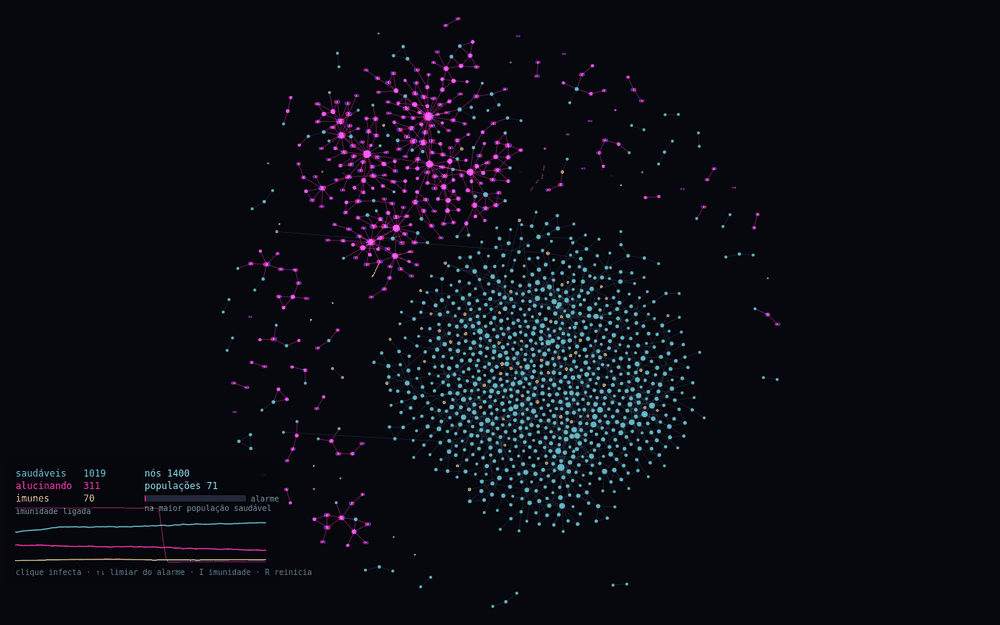

# Delírio

**Autor:** Murilo Jorge de Figueiredo

## O que é

Uma rede de agentes que cresce, adoece e se corta. Os nós são agentes, as
arestas são as conversas entre eles, e a doença é uma **alucinação** que passa
de um agente para outro. A rede se arranja sozinha na tela: cada ligação é uma
mola, os nós se repelem e uma gravidade fraca puxa tudo para o centro.

Quando a rede fica grande, um agente perto do meio começa a alucinar. O delírio
se espalha enquanto a rede ainda não percebeu nada. Quando percebe, quem nunca
delirou corta os vizinhos doentes, quase todos ao mesmo tempo. A rede se parte
em continentes, um saudável e ilhas onde o delírio circula, e as ilhas são
empurradas para longe. Com o tempo, os poucos curados que ficam lúcidos
emigram e as ilhas se esvaziam devagar.

## As regras

Cada agente só conhece os próprios vizinhos e a sua população:

1. **Crescer.** De tempos em tempos nasce um agente, que se liga a outro e a um
   vizinho desse outro.
2. **Contagiar.** Um agente alucinando tem uma pequena chance, a cada instante,
   de passar a alucinação para cada vizinho saudável.
3. **Perceber e cortar.** Um agente saudável pode perceber que o vizinho está
   alucinando e cortar a ligação, religando-se a outro saudável. A chance de
   perceber depende de um **alarme**: a fração de doentes que ele percebe, com
   atraso, dentro da própria população.
4. **O eco.** Quem já delirou não estranha o delírio alheio: não percebe, não
   corta.
5. **Curar.** Quem alucina se cura depois de um tempo. Uma parte dos curados
   fica imune por um período e, enquanto imune, fica **lúcida**: reconhece o
   delírio e, se estiver numa ilha, rompe todos os laços com ela e se liga à
   população saudável. Quando a imunidade passa, ela processou o episódio e
   volta a ser um agente comum.
6. **Não ficar só.** Quem perdeu todas as ligações e não está doente procura,
   aos poucos, alguém na população saudável.

## O que emerge

Emergência é quando o sistema inteiro faz algo que nenhuma das regras diz para
fazer. Nenhuma linha do código fala em "separar", "ilha" ou "onda":

- **O corte coletivo.** Não há ordem central para cortar. Mas como vizinhos
  percebem mais ou menos a mesma coisa, o alarme sobe junto em todos, e a rede
  se rasga de uma vez.
- **Os continentes.** Os cortes locais partem a rede em populações. Pela regra
  do eco, a ilha vira uma bolha de agentes que compartilham o mesmo delírio, e
  ninguém lá dentro corta ninguém.
- **As pontes.** Esta eu não previ. Os poucos lúcidos da ilha, ao fugir, às
  vezes deixam laços para trás e viram pontes. Enquanto a população saudável
  está alerta, ela corta as pontes logo. Depois da separação, porém, ela não vê
  mais doentes à sua volta, o alarme se apaga e ela relaxa. Aí uma ponte fica
  de pé, o delírio atravessa e vem uma segunda onda. É uma fadiga de vigilância
  que ninguém programou.
- **O esvaziamento lento.** Um curado lúcido de cada vez, as ilhas perdem
  gente para o continente saudável.

## Três decisões que fizeram a emergência aparecer

- **A regra do eco.** Sem ela, quem se cura dentro da ilha corta tudo e foge,
  e a ilha nunca se forma: a rede termina em uns 140 fragmentos soltos (numa
  versão anterior, sem as outras regras, passava de 500).
- **O alarme por população.** Na primeira versão o alarme era global, e a
  população saudável continuava em alerta máximo mesmo sem nenhum doente,
  porque a ilha mantinha a média alta. Com o alarme medido dentro de cada
  população, a saudável relaxa, e é isso que permite as ondas voltarem.
- **Romper antes de emigrar.** Quando os curados se religavam à população
  saudável sem romper com a ilha, cada curado virava uma ponte e a ilha nunca
  se formava.

Uma ressalva honesta: o alarme não é estritamente local. Ele é como um
noticiário da própria comunidade, que cada agente acompanha com atraso. As
demais regras só olham para os vizinhos.

## Como rodar

Abra o `index.html` no navegador, ou cole o `sketch.js` em
<https://editor.p5js.org>. A rede cresce sozinha e o primeiro surto começa
quando ela passa de 900 agentes; a separação acontece por volta de um minuto
depois de abrir.

| Tecla | Ação |
|---|---|
| **clique** | faz o agente mais próximo começar a alucinar |
| **↑ / ↓** | sobe / desce o limiar do alarme |
| **I** | liga / desliga a imunidade (ligada por padrão) |
| **R** | reinicia |
| **S** | salva um PNG |
| **espaço** | pausa |

O canvas usa `windowWidth`/`windowHeight`, e a câmera se afasta sozinha para
manter a rede inteira na tela. Cada execução é diferente.

## Parâmetros

No topo do `sketch.js`. Os que mais mudam a história:

- `CHANCE_IMUNE` — fração dos curados que fica lúcida. Com 1, as ilhas se
  esvaziam em uns 20 segundos; com 0,1 (o padrão), levam mais de um minuto.
- `LIMIAR` e `ATRASO` — quando e com que demora o alarme dispara. Limiar baixo
  dispara o corte mais cedo, e o surto tende a ser menor. Acima do padrão a
  diferença some no meio da variação entre execuções.
- `ECO` — desligar mostra por que ele é necessário: nenhuma ilha se forma.
