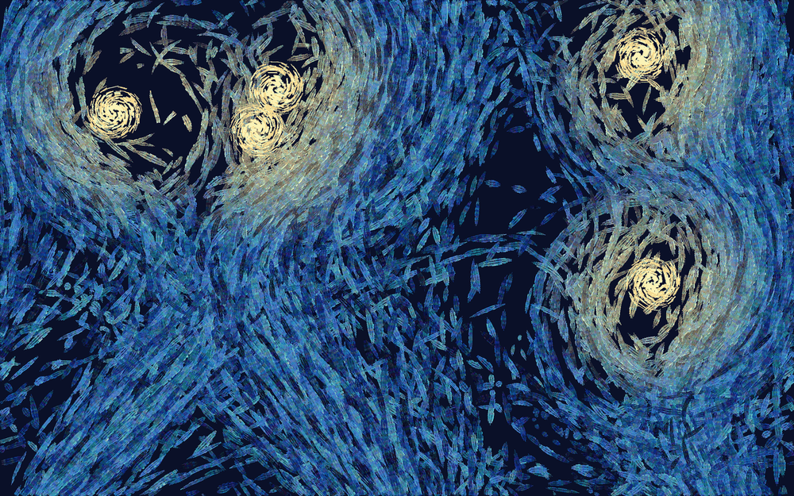

# Enxame Noturno

**Autor:** Murilo Jorge de Figueiredo

## O que é

Uma simulação de **boids** em que cada agente arrasta uma pincelada atrás de si.
A tela nunca é apagada, então o quadro é o rastro acumulado do bando: o que se
vê a qualquer momento é o histórico completo de para onde cada boid foi.

O bando se organiza sozinho pelas três regras de Reynolds (separação,
alinhamento, coesão), orbita em torno de algumas "estrelas" e foge de um
predador que persegue sempre o boid mais próximo. Ninguém desenha as espirais —
elas são o efeito colateral dessa perseguição.

## Inspirações

**Boids — Craig Reynolds (1986)**
<https://www.red3d.com/cwr/boids/>

O algoritmo original. Três regras locais, nenhuma coordenação central, e o
comportamento de bando emerge. Aqui as três estão implementadas na função
`calcularForcas()`, com dois acréscimos meus: um **vórtice** em torno da estrela
mais próxima e o **medo** do predador.

**"A Noite Estrelada" — Vincent van Gogh (1889), MoMA**
<https://www.moma.org/collection/works/79802>

A ligação é o *método*, não o motivo. O céu de Van Gogh não é pintado com
manchas de cor: é feito de pinceladas curtas, direcionais, que se enrolam em
espirais e cuja direção é o próprio assunto do quadro. No sketch, quem dá a
direção de cada pincelada é a **velocidade do boid** naquele instante — ou seja,
o campo de movimento vira o campo de pinceladas, que é o que Van Gogh faz à mão.
Daí vêm também três escolhas concretas:

- A pincelada **afila**: nasce fina, engorda no meio, termina fina, como um
  pincel que encosta, pressiona e levanta.
- Cada traço é feito de **três cerdas paralelas** de cor ligeiramente diferente,
  mais um fio claro na borda imitando o relevo do impasto.
- A **paleta** é a do quadro: azuis profundos e amarelos quentes. A tinta
  "acende" para o amarelo conforme o boid se aproxima de uma estrela.

**O conectoma da mosca — Google Research / HHMI Janelia (setembro de 2026)**
<https://gizmodo.com/google-mapped-a-fruit-flys-brain-now-its-playing-doom-and-super-mario-64-2000808616>
<https://flywire.ai/>

O mapa completo do sistema nervoso da mosca — 166 mil neurônios e 125 milhões de
sinapses — saiu em 3 de setembro de 2026 e virou febre nas redes, com gente
rodando o cérebro simulado dentro do Minecraft, do Doom e do Beat Saber. O que
me interessou não foram as demos, mas as **imagens** do conectoma: milhares de
fibras finas, coloridas por classe de neurônio, que individualmente são
trajetórias legíveis e em conjunto viram textura pura. É exatamente o que
acontece aqui: uma pincelada isolada é só o passo de um boid; cento e trinta
boids durante alguns minutos viram um céu. Como lá, cada agente carrega a cor da
sua "classe" — cada boid nasce com um azul da paleta e o mantém a vida toda, o
que faz aparecerem fios de tonalidade coerente dentro do emaranhado.

## Como funciona

**As três regras.** Cada boid olha os vizinhos dentro de um raio de percepção e
soma três forças: vai na direção do centro de massa deles (coesão), adota a
velocidade média deles (alinhamento) e é empurrado para longe dos que estão
apertando (separação). Na separação, o empurrão é dividido pela distância ao
quadrado — por isso ele é quase nulo de longe e violento de perto.

**O vórtice.** Perto de uma estrela, o boid recebe um empurrão **tangente**
(basta girar o vetor radial em 90°) somado a uma atração fraca. Só a tangente
faria o boid escapar em linha reta; só a atração o faria cair no centro. Juntas,
dão órbita — e a órbita é o que desenha a espiral.

**A perseguição.** O predador vai sempre atrás do boid mais próximo, e o bando
foge dele. Como nenhum dos dois resolve a situação, o quadro nunca estabiliza: é
essa disputa que impede as espirais de virarem anéis perfeitos e repetitivos.

**A pincelada intermitente.** Se cada boid pintasse todo quadro, o rastro seria
uma fita contínua — foi o que aconteceu na primeira versão, e parecia fio de lã,
não tinta. Cada boid pinta em ciclos, com um trecho pintando e um trecho no ar,
e é isso que quebra o rastro em pinceladas soltas.

**As estrelas.** Também são pintadas com o mesmo pincel, em dabs curtos e
tangentes. Na primeira tentativa eram círculos preenchidos, e o disco liso
destoava de toda a textura em volta.

## Como rodar

Abra o `index.html` no navegador, ou cole o `sketch.js` em
<https://editor.p5js.org> e dê Play. Deixe rodando: o quadro leva alguns minutos
para ficar denso.

| Tecla | Ação |
|---|---|
| **R** | limpa a tela e começa um quadro novo |
| **espaço** | congela / retoma a simulação |
| **S** | salva um PNG |
| clique | arrasta a estrela mais próxima para o ponteiro |

O canvas usa `windowWidth`/`windowHeight` e todas as medidas são proporcionais
ao menor lado da janela, então a simulação se comporta igual em qualquer tela.

## Parâmetros

No topo do `sketch.js`: `N_BOIDS`, `N_ESTRELAS`, `R_ESTRELA` (alcance do
vórtice), `R_PERCEPCAO` e `R_SEPARACAO`. Zerar o alcance da estrela deixa o
bando livre e o quadro vira um emaranhado sem espirais — bom para ver quanto do
resultado vem só das regras de Reynolds.
