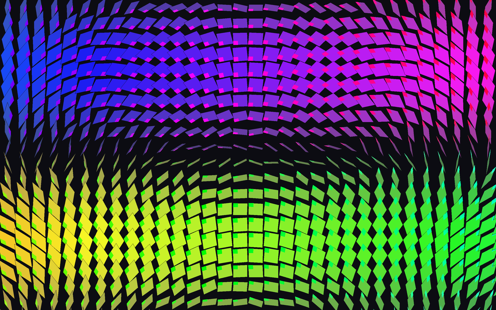

# Matriz — campo de transformações lineares

**Autor:** Murilo Jorge de Figueiredo

## O que é

Uma grade cobre a tela. Em toda célula é desenhado o mesmo quadrado — o mesmo
`rect(-0.5, -0.5, 1, 1)`. O que muda é a matriz 2×2 aplicada antes de desenhar,
com `applyMatrix()`. Toda a variedade da imagem vem da matriz.

## A matriz

`M = R(θ) · C`, onde `C` faz cisalhamento em x e escala em y, e `R` é uma
rotação. Os três números vêm da posição da célula na tela:

- `θ` cresce da esquerda para a direita → as peças giram
- `k` (cisalhamento) cresce da esquerda para a direita → o quadrado vira losango
- `sy` = `sen(v · 0,9π)`, de cima para baixo → a escala vertical

## O determinante

Como `det(R) = 1`, o determinante da matriz é o próprio `sy`. Ele explica as
duas coisas mais visíveis da imagem:

- **A dobra escura no meio.** Ali `sy = 0`, a matriz é singular e esmaga o
  quadrado num segmento de reta. Não foi desenhada — é a matriz perdendo posto.
- **As duas famílias de cor.** Embaixo o determinante é negativo, ou seja, a
  figura é espelhada. Cada peça tem um marcador claro num canto que troca de
  lado ao cruzar a dobra, para o espelhamento ficar visível.

Por ser uma transformação linear, e não perspectiva, retas paralelas continuam
paralelas: as peças estão inclinadas, mas não há ponto de fuga.

## O acaso

Entra só na rotação, e é multiplicado por `1 − |det|`: nulo onde a transformação
preserva área, máximo em cima da dobra, onde ela é quase singular.

## Como rodar

Cole o `sketch.js` em <https://editor.p5js.org> e dê Play, ou abra o
`index.html` no navegador.

Clique ou aperte **R** para gerar outro. **S** salva um PNG. O canvas usa
`windowWidth`/`windowHeight` e se refaz ao redimensionar a janela.

## Parâmetros

No topo do `sketch.js`: `DIVISOES` (finura da grade), `GIRO`, `CISALHAMENTO` e
`BAGUNCA`. Zerar `GIRO` deixa o cisalhamento puro à vista; zerar `BAGUNCA`
mostra a estrutura sem ruído nenhum.
