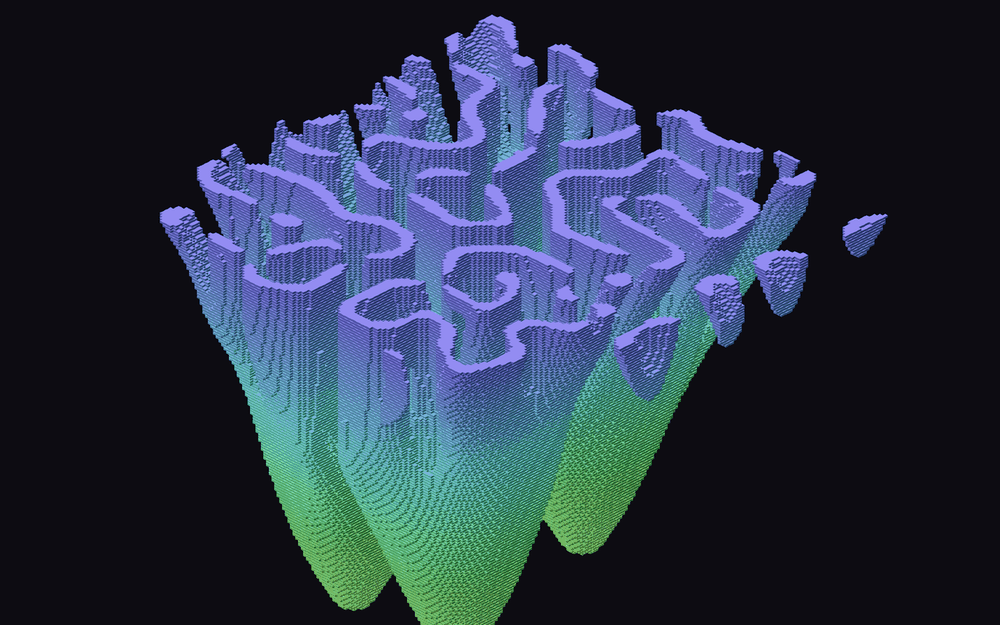

# Mofo

**Autor:** Murilo Jorge de Figueiredo



## O que é

Uma colônia de mofo crescendo numa placa de Petri — só que **o tempo é o eixo
vertical**. A simulação é bidimensional e nada nela é apagado: o instante 0 fica
no chão, o instante seguinte é desenhado um degrau acima, e assim por diante. O
que se constrói é o **diagrama de espaço-tempo** da colônia.

Por isso as colunas caneladas da imagem não são colunas: são manchas que ficaram
paradas no mesmo lugar por muito tempo. As abas que se abrem para os lados são a
colônia avançando sobre o meio. E o labirinto no topo é simplesmente o estado
atual da placa.

## A regra: reação-difusão de Gray-Scott

Duas substâncias ocupam a placa. **U** é o alimento, **V** é o mofo. Onde há
mofo junto de alimento, mais mofo é produzido — e a reação consome duas unidades
de V para cada uma que nasce:

```
U + 2V  →  3V
```

Além de reagir, as duas se **espalham**, mas em velocidades diferentes: o
alimento difunde duas vezes mais rápido que o mofo. Esse desequilíbrio — e só
ele — é o que impede a mistura de virar uma papa uniforme e faz surgirem bordas,
dedos e labirintos. Alan Turing mostrou em 1952 que padrões podem nascer
exatamente assim, de difusão desigual, sem nenhum molde prévio.

```
∂U/∂t = Du·∇²U − U·V² + F·(1 − U)        F repõe alimento
∂V/∂t = Dv·∇²V + U·V² − (F + k)·V        k remove mofo
```

Com F = 0,0545 e k = 0,062 o sistema fica no regime de **crescimento coral**: a
colônia se expande pela borda e vai se dividindo em dedos, sem nunca fechar.
Testei outros sete regimes; o de labirinto (F = 0,029) satura e vira um bloco
maciço, e o de vermes (F = 0,078) morre em poucos passos.

Como o estado é **contínuo** — V é um número real, não vivo/morto — as bordas
são lisas e o empilhamento sai com superfície contínua. Um autômato de
vizinhança pequena daria uma torre de cascalho.

## Três detalhes que a implementação obriga

**Buffer duplo.** Atualizar as concentrações no próprio lugar seria errado: uma
célula já atualizada contaminaria o cálculo da vizinha seguinte, e o resultado
passaria a depender da ordem da varredura. Calcula-se tudo num segundo par de
arrays e troca-se no fim.

**Tabelas de vizinhança.** O laço roda 150 × 150 × 26 vezes por quadro. Guardar
de antemão quem é o vizinho anterior e o seguinte de cada linha e coluna, já
dando a volta no toro, tira todas as divisões de dentro do laço. Medido no Node,
a química de uma camada leva cerca de 9,5 ms.

**Ordem do pintor.** A projeção é isométrica, feita à mão em 2D, sem WEBGL — e
em 2D não há teste de profundidade. A oclusão depende inteiramente da ordem de
desenho: uma camada por quadro, de baixo para cima, e dentro de cada camada
varrendo as diagonais i+j, que é a direção em que a profundidade cresce numa
isométrica.

## Sobre repetição de tema

Antes de escolher, baixei o índice da galeria da turma (`sketches/p5front.json`
do repositório da disciplina) e varri os 131 artefatos das semanas 1 a 4.

- **Autômato celular:** existe um — um Jogo da Vida de Conway 2D, colorido e
  piscante, na semana 2. Por isso não fiz Jogo da Vida.
- **Reação-difusão, Gray-Scott, padrões de Turing:** nenhum.
- **Physarum / mofo com agentes, DLA, formiga de Langton, Lenia:** nenhum.
- **3D:** só um tornado em WEBGL na semana 3. Nenhuma projeção isométrica.

Cheguei a considerar *Physarum*, a simulação clássica de mofo com agentes que
deixam rastro de feromônio. Descartei por um motivo que vale registrar: ela é
agentes-que-deixam-rastro, exatamente a família do meu artefato anterior (boids
pintando). Reação-difusão não tem agente nenhum — é uma equação sobre uma grade
— e por isso é uma ideia realmente nova, e não a mesma ideia repintada.

Os temas mais saturados da turma — cidades noturnas, espirais, túneis, mandalas
e campos de fluxo — ficaram de fora de propósito.

## Como rodar

Abra o `index.html` no navegador, ou cole o `sketch.js` em
<https://editor.p5js.org> e dê Play. A torre cresce uma camada por quadro e para
sozinha na camada 145.

| Tecla | Ação |
|---|---|
| **R** ou clique | nova placa, nova contaminação |
| **espaço** | congela / retoma o crescimento |
| **S** | salva um PNG |

O canvas usa `windowWidth`/`windowHeight` e todas as medidas são proporcionais
ao menor lado da janela.

## Parâmetros

No topo do `sketch.js`. O mais interessante é o `LIMIAR`, que decide a partir de
qual concentração consideramos que há mofo ali: em 0,2 a colônia vira um sólido
maciço; em 0,4 sobram só as cristas, e a torre vira uma renda de dedos finos.
Depois dele, `F` e `K` mudam o regime inteiro da química, e
`PASSOS_POR_CAMADA` controla quanto tempo passa entre um andar e o seguinte —
poucos passos dão uma torre lisa e lenta, muitos dão saltos bruscos entre
camadas.
