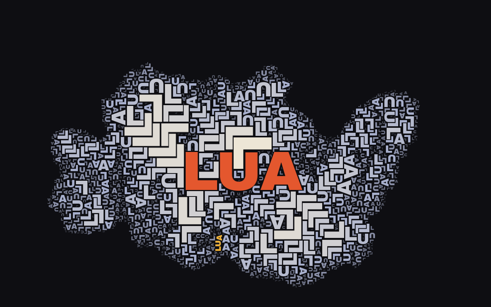

# Trama

**Autor:** Murilo Jorge de Figueiredo

## O que é

Digite uma palavra no campo do topo. Em volta dela cresce, animado, um mosaico
feito das suas próprias letras, cada uma travada nas vizinhas como peça de
quebra-cabeça. Cada tecla digitada recomeça o mosaico com a palavra nova.

## Como as letras se encaixam

A "hitbox" de cada letra é a **própria forma dela**, em proporção natural. O
plano é uma grade fina (3 × 3 pixels por célula) onde cada letra colocada marca
a sua tinta. Uma letra nova, com giro e tamanho sorteados, procura posição junto
às que já estão lá, com duas regras:

- **não pode encostar tinta em tinta:** há uma folga de 1 célula entre as formas,
  para as peças continuarem legíveis como peças;
- **precisa abraçar as vizinhas:** mede-se que fração do contorno dela fica
  colada, a até 2 células, na tinta de outra letra. Um V no vão de um M, a quina
  de um L na quina de outro, um A de ponta-cabeça entre duas pernas de A — esses
  encaixes colam muito contorno. Só entra quem passa do **encaixe mínimo**.

As letras grandes são tentadas primeiro, e o tamanho vai diminuindo. Onde nada
encaixa, fica buraco.

## A borda que se dissolve

Não há uma parede onde o mosaico para. O tamanho máximo permitido cai com a
distância ao centro: até cerca de um terço do raio, qualquer tamanho; daí até a
borda, o teto cai numa curva — devagar no começo, despencando perto da borda —
até letras de uns 5 pixels, quase grãos. As menores também desbotam em direção
ao fundo. O mosaico termina numa poeira de letras cada vez menores e mais
apagadas, que continuam encaixadas até o fim — como um fractal que se desfaz.

## A palavra que aparece sozinha

Às vezes, ao se encaixarem, as letras escrevem a própria palavra: mesmo tamanho,
mesmo giro, em sequência na direção de leitura daquele giro e alinhadas como numa
linha de texto. Quando isso acontece, elas acendem em dourado, e a barra do topo
avisa quantas vezes a palavra se formou. Nada força isso a acontecer; é raro, e
é o acaso do encaixe — no thumbnail, um LUA dourado na vertical, lido de baixo
para cima, embaixo e à esquerda da palavra.

## Como o mosaico cresce

Não há uma grade de casas a preencher: é um **empacotamento por acreção**. O
mosaico cresce da palavra para fora, sempre pela borda mais próxima do centro,
como um cristal.

Para ser rápido o bastante para animar, a busca só testa as posições em que o
contorno da letra nova passa exatamente por uma célula de tinta vizinha — toda
posição testada já encosta em algo —, e o teste de colisão percorre a letra em
ordem embaralhada, para achar uma colisão logo nas primeiras células. Com isso o
mosaico fica pronto cerca de 3,7 vezes mais rápido do que varrendo todas as
posições em volta, sem perder qualidade.

O encaixe mínimo muda o caráter do mosaico. Com 0,27 (o padrão), só encaixes
justos passam: o mosaico não chega a preencher a elipse e cresce em formas
irregulares, uma silhueta própria para cada palavra — às vezes uma ilha
recortada com poucas centenas de letras, às vezes uma nuvem com milhares. Descendo
para uns 0,20, quase todo encaixe passa e ele preenche a elipse inteira.

## Como usar

Abra o `index.html` no navegador. O sketch começa com uma palavra sorteada, já
selecionada no campo: é só digitar para trocar.

| Controle | Ação |
|---|---|
| **campo do topo** | a palavra; cada tecla recomeça o mosaico (só letras) |
| **− / +** ou **↓ / ↑** | diminui / aumenta o encaixe mínimo e recomeça |
| **↻** ou **Enter** | tece a mesma palavra de novo |
| **salvar** | salva a imagem |
| **Esc** | limpa a palavra |

O p5.js (versão 2.3.4) e a fonte Archivo Black são carregados de CDN (jsDelivr);
nenhum dos dois está no zip. O canvas usa `windowWidth`/`windowHeight`, e o
tamanho das letras se ajusta ao comprimento da palavra.
